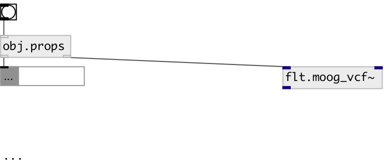

[index](index.html) :: [base](category_base.html)
---

# obj.props

###### property extractor

*доступно с версии:* 0.7

---

## информация
extract properties from object, connected to second outlet

## входы:

* output extracted properties to first outlet 
_тип:_ control

## выходы:

* property output (data:dict) 
_тип:_ control
* connect to examined object 
_тип:_ control

## ключевые слова:

[property](keywords/property.html)

**Авторы:** Serge Poltavsky

**Лицензия:** GPL3 or later

