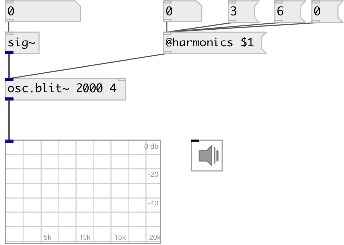

[index](index.html) :: [osc](category_osc.html)
---

# osc.blit~

###### Bandlimited impulse train oscillator

*доступно с версии:* 0.6

---

## аргументы:

* **freq**
default frequency (440hz if not specified) 
_тип:_ float 
_единица:_ Hz 

## свойства:

* **@harmonics** 
Получить/установить number of harmonics. 0 means all available harmonics until SR/2 
_тип:_ int 
_минимальное значение:_ 0 
_по умолчанию:_ 0 

## входы:

* frequency in Hz 
_тип:_ audio
* reset phase 
_тип:_ control

## выходы:

* output signal 
_тип:_ audio

## ключевые слова:

[oscillator](keywords/oscillator.html)
[band-limited](keywords/band-limited.html)

**Смотрите также:**
[\[osc.saw~\]](osc.saw~.html)
[\[osc.square~\]](osc.square~.html)

**Авторы:** Serge Poltavsky

**Лицензия:** GPL3 or later

