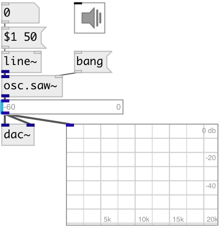

[index](index.html) :: [osc](category_osc.html)
---

# osc.saw~

###### Alias-free sawtooth wave

*доступно с версии:* 0.1

---

## информация
Polynomial Transition Regions (PTR) used for aliasing suppression. 2nd order interpolation.

## аргументы:

* **freq**
frequency 
_тип:_ float 
_единица:_ Hz 

## свойства:

* **@active** 
Получить/установить on/off dsp processing 
_тип:_ int 
_варианты:_ 0, 1 
_по умолчанию:_ 1 

## входы:

* frequency in Hz 
_тип:_ audio
* reset phase 
_тип:_ control

## выходы:

* output signal 
_тип:_ audio

## ключевые слова:

[oscillator](keywords/oscillator.html)
[band-limited](keywords/band-limited.html)

**Смотрите также:**
[\[osc.saw4~\]](osc.saw4~.html)
[\[osc.tri~\]](osc.tri~.html)
[\[osc.square~\]](osc.square~.html)
[\[lfo.tri~\]](lfo.tri~.html)

**Авторы:** Serge Poltavsky

**Лицензия:** GPL3 or later

