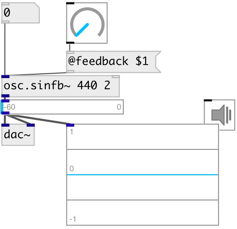

[index](index.html) :: [osc](category_osc.html)
---

# osc.sinfb~

###### Sine oscilator with feedback

*доступно с версии:* 0.1

---

## аргументы:

* **FREQ**
initial frequency 
_тип:_ float 
_единица:_ Hz 

* **FEEDBACK**
oscillator feedback coefficient in range 0..2pi 
_тип:_ float 

## свойства:

* **@feedback** 
Запросить/установить oscillator feedback coefficient 
_тип:_ float 
_диапазон:_ 0..6.2832 
_по умолчанию:_ 0 

* **@active** 
Запросить/установить on/off dsp processing 
_тип:_ bool 
_по умолчанию:_ 1 

* **@osc** (initonly)
Запросить/установить OSC server name to listen 
_тип:_ symbol 

* **@id** (initonly)
Запросить/установить OSC address id. If specified, bind all properties to /ID/osc_sinfb/PROP_NAME
osc address, if empty bind to /osc_sinfb/PROP_NAME. 
_тип:_ symbol 

## входы:

* frequency 
_тип:_ audio
* reset phase 
_тип:_ control

## выходы:

* output signal 
_тип:_ audio

## ключевые слова:

[osc](keywords/osc.html)
[feedback](keywords/feedback.html)

**Авторы:** Serge Poltavsky

**Лицензия:** GPL3 or later

