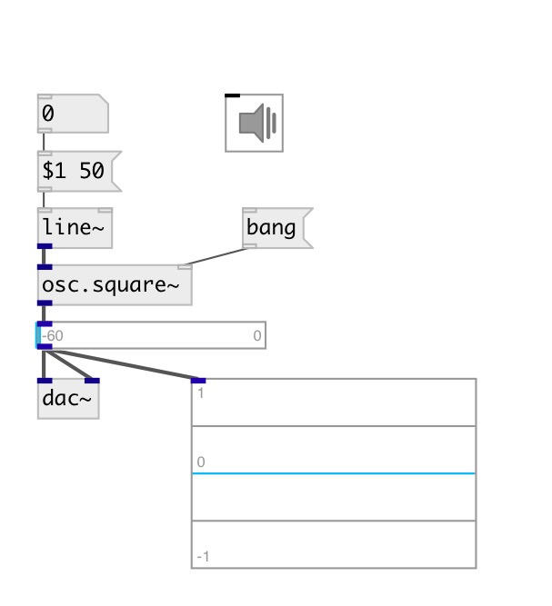

[index](index.html) :: [osc](category_osc.html)
---

# osc.square~

###### осциллятор квадратной волны с ограниченным спектром

*доступно с версии:* 0.1

---

## аргументы:

* **FREQ**
See @freq 
_тип:_ float 
_единица:_ Hz 

## свойства:

* **@osc** (initonly)
Запросить/установить OSC server name to listen 
_тип:_ symbol 

* **@id** (initonly)
Запросить/установить OSC address id. If specified, bind all properties to /ID/osc_square/PROP_NAME
osc address, if empty bind to /osc_square/PROP_NAME. 
_тип:_ symbol 

* **@active** 
Запросить/установить on/off dsp processing 
_тип:_ bool 
_по умолчанию:_ 1 

* **@freq** 
Запросить/установить frequency 
_тип:_ float 
_единица:_ Hz 
_диапазон:_ 0..22050 
_по умолчанию:_ 0 

## входы:

* frequency in Hz 
_тип:_ audio
* reset phase 
_тип:_ control

## выходы:

* output signal 
_тип:_ audio

## ключевые слова:

[oscillator](keywords/oscillator.html)
[band-limited](keywords/band-limited.html)

**Смотрите также:**
[\[osc.saw~\]](osc.saw~.html)
[\[osc.tri~\]](osc.tri~.html)
[\[lfo.square~\]](lfo.square~.html)

**Авторы:** Serge Poltavsky

**Лицензия:** GPL3 or later

