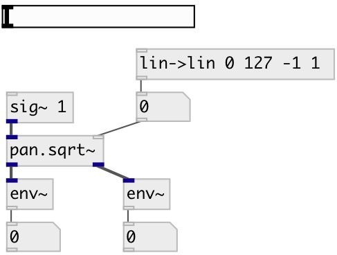

[index](index.html) :: [spat](category_spat.html)
---

# pan.sqrt~

###### two channel equal power square root panner

*доступно с версии:* 0.5

---

## информация
Two channel equal power panner. About is about 3dB center reduction. With linear panning ([pan.lin~]) the signal is lowered as it approaches center using a straight line from (+-)1 (left or right) to 0 (center) for a 6dB reduction in the middle. A problem inherent to linear panning is that the perceived volume of the signal drops in the middle. [pan.sqrt~] solves this.

## аргументы:

* **POS**
panning position. -1 means left, 0 - center, +1 - right 
_тип:_ float 

## свойства:

* **@pos** 
Получить/установить panning position. -1 means left, 0 - center, +1 - right 
_тип:_ float 
_диапазон:_ -1..1 
_по умолчанию:_ 0 

* **@smooth** (readonly)
Получить smooth control signal to avoid zipping-noise 
_тип:_ int 
_диапазон:_ 0..100 
_по умолчанию:_ 20 

## входы:

* input signal 
_тип:_ audio
* pan position 
_тип:_ control

## выходы:

* left output channel 
_тип:_ audio
* right output channel 
_тип:_ audio

## ключевые слова:

[pan](keywords/pan.html)
[span](keywords/span.html)

**Смотрите также:**
[\[pan.lin~\]](pan.lin~.html)
[\[pan.cos~\]](pan.cos~.html)

**Авторы:** Serge Poltavsky

**Лицензия:** GPL3 or later

