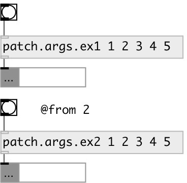

[index](index.html) :: [patch](category_patch.html)
---

# patch.args

###### Get patch or subpatch arguments

*доступно с версии:* 0.4

---

## свойства:

* **@from** 
Получить/установить starting args index 
_тип:_ int 
_минимальное значение:_ 0 
_по умолчанию:_ 0 

## входы:

* output patch or subpatch arguments 
_тип:_ control

## выходы:

* list of arguments 
_тип:_ control

## ключевые слова:

[patch](keywords/patch.html)
[args](keywords/args.html)
[arguments](keywords/arguments.html)
[canvas](keywords/canvas.html)

**Смотрите также:**
[\[canvas.current\]](canvas.current.html)
[\[canvas.top\]](canvas.top.html)
[\[list-&gt;props\]](list-%3Eprops.html)

**Авторы:** Serge Poltavsky

**Лицензия:** GPL3 or later

