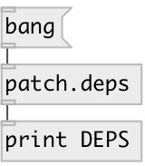

[index](index.html) :: [patch](category_patch.html)
---

# patch.deps

###### patch dependencies: used objects and abstractions

*доступно с версии:* 0.9.0

---

## методы:

* **dump**
output dependency tree to Pd window 

## входы:

* output patch dependencies as Dict. Keys are library external paths or abstraction full paths, values are external or abstraction names. PureData core objects listed under &#34;_core&#34; key. 
_тип:_ control

## выходы:

* patch dependency 
_тип:_ control

## ключевые слова:

[patch](keywords/patch.html)
[canvas](keywords/canvas.html)
[deps](keywords/deps.html)

**Смотрите также:**
[\[patch.tree\]](patch.tree.html)

**Авторы:** Serge Poltavsky

**Лицензия:** GPL3 or later

