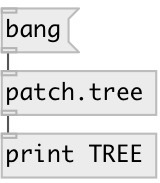

[index](index.html) :: [patch](category_patch.html)
---

# patch.tree

###### patch tree

*доступно с версии:* 0.9.1

---

## входы:

* output current patch tree as Dict 
_тип:_ control

## выходы:

* patch tree as Dict 
_тип:_ control

## ключевые слова:

[patch](keywords/patch.html)
[tree](keywords/tree.html)

**Смотрите также:**
[\[patch.deps\]](patch.deps.html)

**Авторы:** Serge Poltavsky

**Лицензия:** GPL3 or later

