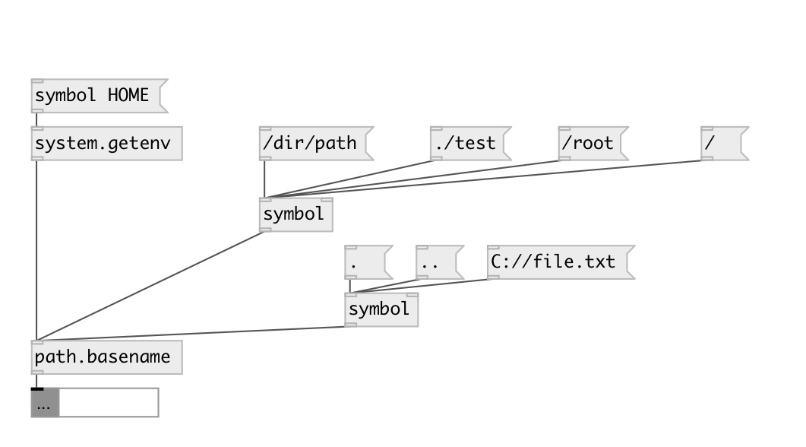

[index](index.html) :: [path](category_path.html)
---

# path.basename

###### outputs filename portion of pathname

*доступно с версии:* 0.1

---

## входы:

* outputs filename portion of pathname 
_тип:_ control

## выходы:

* filename 
_тип:_ control

## ключевые слова:

[path](keywords/path.html)
[environment](keywords/environment.html)

**Смотрите также:**
[\[path.dirname\]](path.dirname.html)

**Авторы:** Serge Poltavsky

**Лицензия:** GPL3 or later

