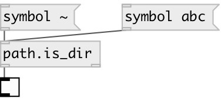

[index](index.html) :: [path](category_path.html)
---

# path.is_dir

###### check if path is directory

*доступно с версии:* 0.9

---

## входы:

* output 1 if given path is found and is directory, otherwise false 
_тип:_ control

## выходы:

* 1 or 0 
_тип:_ control
* output path if it&#39;s directory 
_тип:_ control

## ключевые слова:

[path](keywords/path.html)
[dir](keywords/dir.html)

**Авторы:** Serge Poltavsky

**Лицензия:** GPL3 or later

