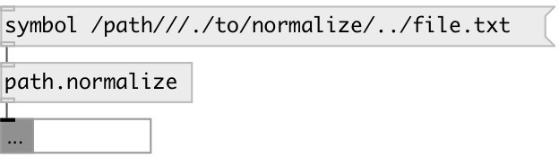

[index](index.html) :: [path](category_path.html)
---

# path.normalize

###### normalize file paths

*доступно с версии:* 0.9.4

---

## информация
These conversions are purely lexical. They do not check that the paths exist, do not follow symlinks, and do not access the filesystem at all

## входы:

* file path 
_тип:_ control

## выходы:

* symbol or data:string: normalized path 
_тип:_ control

## ключевые слова:

[path](keywords/path.html)
[normalize](keywords/normalize.html)

**Смотрите также:**
[\[path.split\]](path.split.html)

**Авторы:** Serge Poltavsky

**Лицензия:** GPL3 or later

