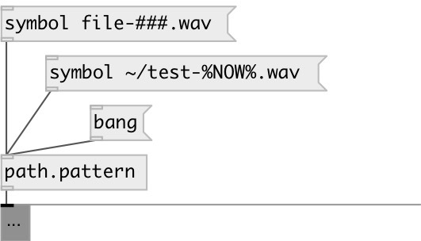

[index](index.html) :: [path](category_path.html)
---

# path.pattern

###### pattern filename generator

*доступно с версии:* 0.9.5

---

## информация
Note: generate NEW filename (checks that generated filename not exists) ### sequence is replaced with number Following variables in pattern expanded: • %YEAR% - current year (4-digits) • %MONTH% - current month (2-digits) • %DAY% - current day (2-digits) • %HOUR% - current hour (2-digits) • %MIN% - current minute (2-digits) • %SEC% - current second (2-digits) • %TIME% - current time: %HOUR%-%MIN%-%SEC% • %DATE% - current date: %YEAR%-%MONTH%-%DAY% • %NOW% - current datetime: %DATE%_%TIME%

## аргументы:

* **PATTERN**
filename generation pattern 
_тип:_ symbol 

## свойства:

* **@pattern** 
Запросить/установить filename pattern 
_тип:_ symbol 

## входы:

* output generated filename pattern 
_тип:_ control

## выходы:

* symbol: filename 
_тип:_ control

## ключевые слова:

[path](keywords/path.html)
[environment](keywords/environment.html)
[pattern](keywords/pattern.html)
[filename](keywords/filename.html)

**Авторы:** Serge Poltavsky

**Лицензия:** GPL3 or later

