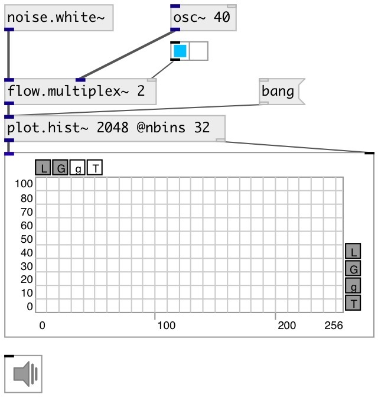

[index](index.html) :: [array](category_array.html)
---

# plot.hist~

###### calculate and output signal histogram

*доступно с версии:* 0.9

---

## аргументы:

* **NSAMP**
@nsamp property 
_тип:_ int 

## свойства:

* **@nsamp** 
Получить/установить max number of input samples 
_тип:_ int 
_диапазон:_ 8..32768 
_по умолчанию:_ 512 

* **@nbins** 
Получить/установить number of histogram bins 
_тип:_ int 
_диапазон:_ 8..512 
_по умолчанию:_ 63 

* **@min** 
Получить/установить minimal input value 
_тип:_ float 
_по умолчанию:_ -1 

* **@max** 
Получить/установить maximum input value 
_тип:_ float 
_по умолчанию:_ 1 

* **@clip** 
Получить/установить clip input values into input range, otherwise just ignore them 
_тип:_ int 
_варианты:_ 0, 1 
_по умолчанию:_ 1 

## входы:

* starts histogram calculation 
_тип:_ audio

## выходы:

* signal output 
_тип:_ audio
* output to [array.plot~] or [ui.plot~] 
_тип:_ control

## ключевые слова:

[array](keywords/array.html)
[histogram](keywords/histogram.html)

**Смотрите также:**
[\[plot.linspace~\]](plot.linspace~.html)
[\[plot.geomspace~\]](plot.geomspace~.html)
[\[plot.response~\]](plot.response~.html)

**Авторы:** Serge Poltavsky

**Лицензия:** GPL3 or later

