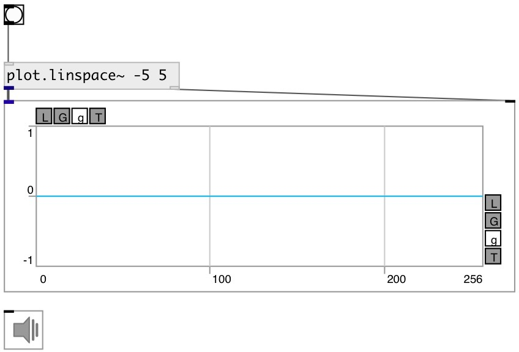

[index](index.html) :: [array](category_array.html)
---

# plot.linspace~

###### outputs numbers spaced evenly spaced over a specified interval

*доступно с версии:* 0.9

---

## аргументы:

* **START**
@start property 
_тип:_ float 

* **STOP**
@stop property 
_тип:_ float 

* **N**
@n property 
_тип:_ int 

## свойства:

* **@start** 
Запросить/установить the starting value of the sequence 
_тип:_ float 
_по умолчанию:_ 0 

* **@stop** 
Запросить/установить the final value of the sequence, unless @endpoint is false. In that case, @n +
1 values are spaced over the interval in lin-space, of which all but the last
(a sequence of length @n) are returned. 
_тип:_ float 
_по умолчанию:_ 255 

* **@n** 
Запросить/установить number of points 
_тип:_ int 
_диапазон:_ 4..1024 
_по умолчанию:_ 256 

* **@base** 
Запросить/установить x-axis scale base 
_тип:_ atom 
_варианты:_ 0, pi 
_по умолчанию:_ 0 

* **@pi** 
Запросить/установить alias to @base pi 
_тип:_ atom 

* **@endpoint** 
Запросить/установить include @stop to interval 
_тип:_ bool 
_по умолчанию:_ 1 

## входы:

* starts output 
_тип:_ control

## выходы:

* signal output 
_тип:_ audio
* output to [array.plot~] or [ui.plot~] 
_тип:_ control

## ключевые слова:

[array](keywords/array.html)
[linear](keywords/linear.html)
[scale](keywords/scale.html)

**Смотрите также:**
[\[plot.geomspace~\]](plot.geomspace~.html)
[\[plot.logspace~\]](plot.logspace~.html)

**Авторы:** Serge Poltavsky

**Лицензия:** GPL3 or later

