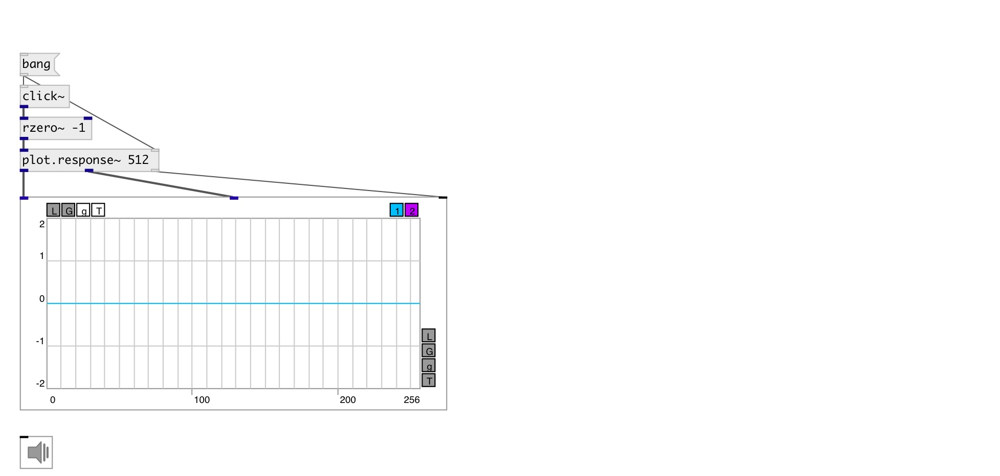

[index](index.html) :: [array](category_array.html)
---

# plot.response~

###### output amp/phase freq response to impulse

*доступно с версии:* 0.9

---

## аргументы:

* **N**
@n property 
_тип:_ int 

## свойства:

* **@n** 
Получить/установить number of processed samples 
_тип:_ int 
_диапазон:_ 32..8192 
_по умолчанию:_ 512 

* **@db** 
Получить/установить decibel mode. It true outputs amplitude in decibels 
_тип:_ int 
_варианты:_ 0, 1 
_по умолчанию:_ 0 

* **@sr** 
Получить/установить using samplerate. If true output in [0..SR/2] instead of [0..pi] 
_тип:_ int 
_варианты:_ 0, 1 
_по умолчанию:_ 0 

## входы:

* input signal 
_тип:_ audio
* starts response calculation 
_тип:_ control

## выходы:

* frequency response 
_тип:_ audio
* phase response 
_тип:_ audio
* output to [array.plot~] or [ui.plot~] 
_тип:_ control

## ключевые слова:

[array](keywords/array.html)
[histogram](keywords/histogram.html)

**Смотрите также:**
[\[plot.linspace~\]](plot.linspace~.html)
[\[plot.geomspace~\]](plot.geomspace~.html)

**Авторы:** Serge Poltavsky

**Лицензия:** GPL3 or later

