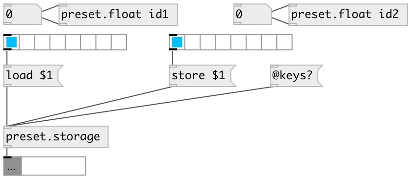

[index](index.html) :: [preset](category_preset.html)
---

# preset.storage

###### preset storage control

*доступно с версии:* 0.4

---

## информация
Preset storage allows to load and store presets, read and write them to files

## методы:

* **clear**
clear preset by index, if no index specified use 0 

* **duplicate**
fill empty presets by coping exiting values 

* **interp**
loads linearry interpolated value between preset, for example: 1.5 means load
interpolated value between preset 1 and 2. 
  __параметры:__
  - **IDX** preset interpolation index 
    тип: float  
    обязательно: True  

* **load**
load preset by index, if no index specified use 0 

* **read**
read presets from file. If no filename specified use autogenerated name like
PATCHNAME-preset.txt. File preset entries that are not correspondent to patch
existant entries are ignored 

* **store**
stores preset by index, if no index specified use 0 

* **update**
update all values 

* **write**
write presets from file. If no filename specified use autogenerated name like
PATCHNAME-preset.txt 

## свойства:

* **@keys** (readonly)
Запросить list of all existing preset keys 
_тип:_ list 

## входы:

* output list content 
_тип:_ control

## выходы:

* list output 
_тип:_ control

## ключевые слова:

[preset](keywords/preset.html)
[storage](keywords/storage.html)

**Смотрите также:**
[\[preset.float\]](preset.float.html)
[\[preset.symbol\]](preset.symbol.html)
[\[preset.list\]](preset.list.html)

**Авторы:** Serge Poltavsky

**Лицензия:** GPL3 or later

