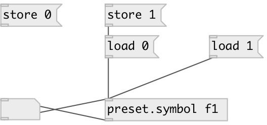

[index](index.html) :: [preset](category_preset.html)
---

# preset.symbol

###### load/store symbol preset

*доступно с версии:* 0.4

---

## информация
Named symbol preset entry. Can store/load up to 256 various symbol values

## аргументы:

* **ID**
preset id (should be unique in most use cases) 
_тип:_ symbol 

* **INIT**
preset initial value 
_тип:_ symbol 

## методы:

* **load**
load preset value by specified index and output it 

* **store**
stores preset value at specified index 

* **clear**
clear preset at specified index 

## свойства:

* **@path** (readonly)
Запросить property OSC-like path that includes id, abstraction name and may be subpatch
name separated by slashes. 
_тип:_ symbol 

* **@id** (initonly)
Запросить/установить preset id 
_тип:_ symbol 

* **@init** (initonly)
Запросить/установить init symbol value 
_тип:_ symbol 

* **@global** (initonly)
Запросить/установить use global path like /ID 
_тип:_ flag 
_по умолчанию:_ 0 

* **@subpatch** (initonly)
Запросить/установить include subpatch name to path 
_тип:_ flag 
_по умолчанию:_ 0 

## входы:

* set preset value without output 
_тип:_ control

## выходы:

* preset symbol value 
_тип:_ control

## ключевые слова:

[preset](keywords/preset.html)
[storage](keywords/storage.html)
[symbol](keywords/symbol.html)

**Смотрите также:**
[\[preset.storage\]](preset.storage.html)
[\[preset.float\]](preset.float.html)
[\[preset.list\]](preset.list.html)

**Авторы:** Serge Poltavsky

**Лицензия:** GPL3 or later

