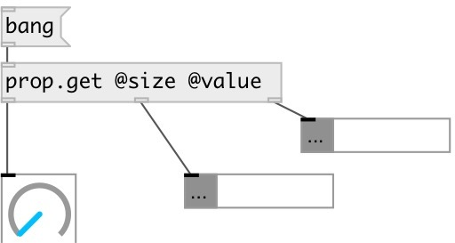

[index](index.html) :: [property](category_property.html)
---

# prop.get

###### get property from connected object/subpatch/abstraction

*доступно с версии:* 0.9

---

## информация
Get properties from connected object/subpatch/abstraction

## аргументы:

* **PROPS**
property names 
_тип:_ list 

## входы:

* output specified properites to corresponding outlets 
_тип:_ control

## выходы:

* connected to destination object 
_тип:_ control
* output of first requested property 
_тип:_ control
* output of ... requested property 
_тип:_ control
* output of n-th requested property 
_тип:_ control

## ключевые слова:

[property](keywords/property.html)

**Смотрите также:**
[\[prop&lt;-\]](prop%3C-.html)

**Авторы:** Serge Poltavsky

**Лицензия:** GPL3 or later

