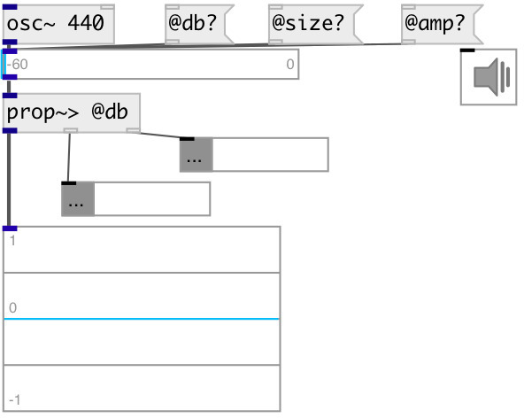

[index](index.html) :: [property](category_property.html)
---

# prop.get~

###### Property extractor from sound stream

*доступно с версии:* 0.6

---

## информация
Extracts properties from sound stream with matching. Non property values are passed untouched.

## входы:

* input values and sound 
_тип:_ audio

## выходы:

* passed values and sound 
_тип:_ audio
* first matched property output 
_тип:_ control
* others matched property output 
_тип:_ control
* unmatched property output 
_тип:_ control

## ключевые слова:

[property](keywords/property.html)

**Смотрите также:**
[\[prop-&gt;\]](prop-%3E.html)

**Авторы:** Serge Poltavsky

**Лицензия:** GPL3 or later

