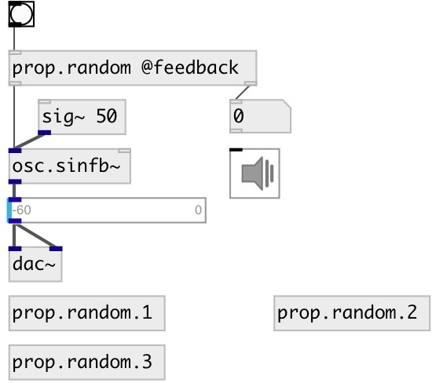

[index](index.html) :: [property](category_property.html)
---

# prop.random

###### property randomizer

*доступно с версии:* 0.9.4

---

## аргументы:

* **SEED**
init random seed 
_тип:_ int 

* **PROPS**
properties names 
_тип:_ list 

## свойства:

* **@seed** 
Получить/установить random seed 
_тип:_ int 
_по умолчанию:_ float 

## входы:

* first specified property 
_тип:_ control
* ... specified property 
_тип:_ control
* n-th specified property 
_тип:_ control

## выходы:

* connect to target object 
_тип:_ control
* atom: new random value 
_тип:_ control

## ключевые слова:

[property](keywords/property.html)
[random](keywords/random.html)

**Смотрите также:**
[\[prop\]](prop.html)
[\[prop.declare\]](prop.declare.html)
[\[patch.props\]](patch.props.html)

**Авторы:** Serge Poltavsky

**Лицензия:** GPL3 or later

