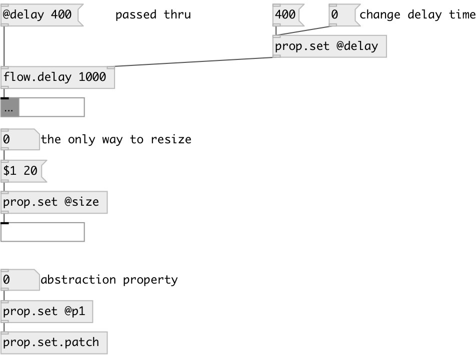

[index](index.html) :: [property](category_property.html)
---

# prop.set

###### set property for connected object/subpatch/abstraction

*доступно с версии:* 0.9

---

## информация
The object adds ability to change properties of flow objects that should accept any incoming messages. The object should be connected to destination, but it not sends pd messages to change props, but using internal pd method calls Object can be used with patch declared user properties Note: you can connect to *any* destination inlet

## аргументы:

* **PROPS**
property names 
_тип:_ list 

## входы:

* first property value 
_тип:_ control
* ... property value 
_тип:_ control
* n-th property value 
_тип:_ control

## выходы:

* outputs nothing. connect to destination object(s) 
_тип:_ control

## ключевые слова:

[property](keywords/property.html)

**Смотрите также:**
[\[prop.get\]](prop.get.html)

**Авторы:** Serge Poltavsky

**Лицензия:** GPL3 or later

