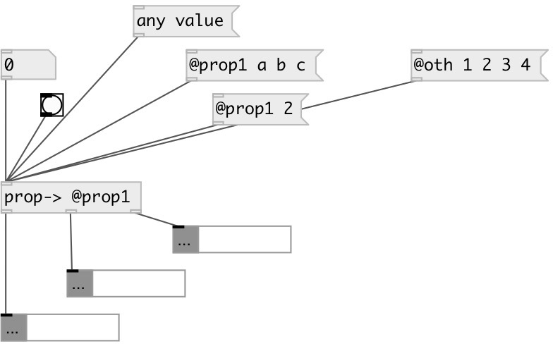

[index](index.html) :: [property](category_property.html)
---

# prop.split

###### separate properties from dataflow

*доступно с версии:* 0.9

---

## информация
Extracts properties from data stream with matching. Non property values are passed untouched

## входы:

* input values 
_тип:_ control

## выходы:

* passed values 
_тип:_ control
* first matched property value (without property selector) 
_тип:_ control
* others matched property value 
_тип:_ control
* unmatched property output (with selector) 
_тип:_ control

## ключевые слова:

[property](keywords/property.html)

**Смотрите также:**
[\[prop&lt;-\]](prop%3C-.html)

**Авторы:** Serge Poltavsky

**Лицензия:** GPL3 or later

