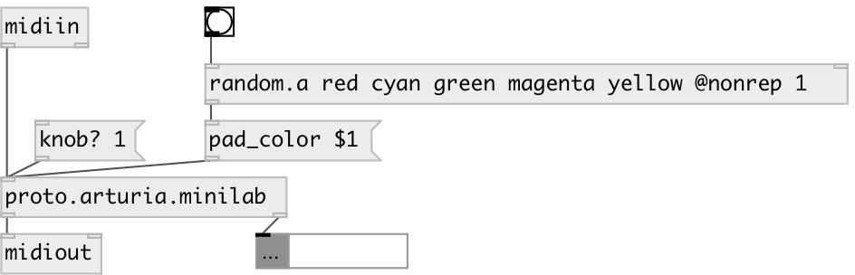

[index](index.html) :: [proto](category_proto.html)
---

# proto.arturia.minilab

###### simple SysEx control for Arturia MiniLab

*доступно с версии:* 0.9.7

---

## методы:

* **backlight**
turn on/off pad backlight 
  __параметры:__
  - **VALUE** on/off state 
    тип: bool  
    обязательно: True  

* **channel**
set device MIDI channel 
  __параметры:__
  - **CH** MIDI channel 
    тип: int  
    обязательно: True  

* **knob**
set knob value 
  __параметры:__
  - **N** knob index 
    тип: int  
    обязательно: True  

  - **VAL** knob value 
    тип: float  
    обязательно: True  

* **knob?**
request knob value 
  __параметры:__
  - **N** knob index 
    тип: int  
    обязательно: True  

* **knobs?**
request all knob values 

* **pad_color**
set pad color 
  __параметры:__
  - **[N]** pad index. If not specified set color to all pads 
    тип: int  

  - **COLOR** color 
    тип: atom  
    обязательно: True  

## входы:

* commands 
_тип:_ control

## выходы:

* MIDI bytes 
_тип:_ control
* parsed MIDI commands: noteon, noteoff, cc, program etc... 
_тип:_ control

## ключевые слова:

[arturia](keywords/arturia.html)
[midi](keywords/midi.html)
[sysex](keywords/sysex.html)

**Авторы:** Serge Poltavsky

**Лицензия:** GPL3 or later

