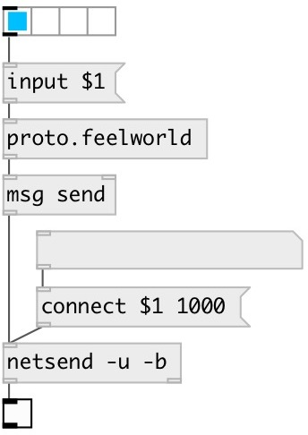

[index](index.html) :: [proto](category_proto.html)
---

# proto.feelworld

###### protocol for FeelWorld LivePro L1 HDMI mixer

*доступно с версии:* 0.9.5

---

## методы:

* **input**
select HDMI input 
  __параметры:__
  - **N** input index 
    тип: int  
    обязательно: True  

## входы:

* commands 
_тип:_ control

## выходы:

* list: bytes to send to UDP port 1000 
_тип:_ control

## ключевые слова:

[video](keywords/video.html)
[mixer](keywords/mixer.html)
[fellworld](keywords/fellworld.html)

**Авторы:** Serge Poltavsky

**Лицензия:** GPL3 or later

