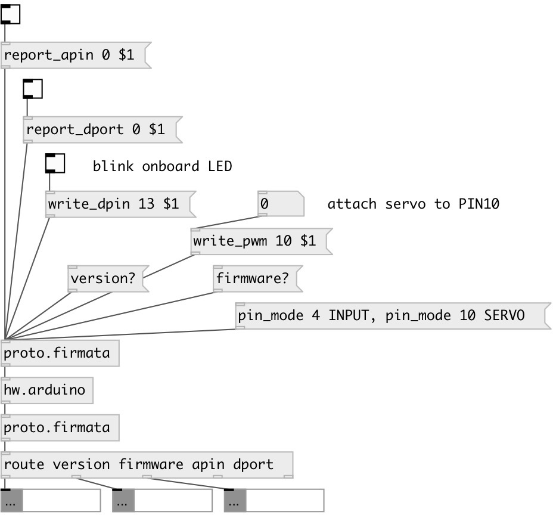

[index](index.html) :: [proto](category_proto.html)
---

# proto.firmata

###### Firmata Arduino protocol support

*доступно с версии:* 0.5

---

## информация
Firmata basic protocol support.

## методы:

* **apin_mapping?**
query mapping between analog port number and digital pin. Analog messages are
numbered 0 to 15, which traditionally refer to the Arduino pins labeled A0, A1,
A2, etc. However, these pis are actually configured using &#34;normal&#34; pin numbers
in the pin mode message, and when those pins are used for non-analog functions.
The analog mapping query provides the information about which pins (as used
with Firmata&#39;s pin mode message) correspond to the analog channels. Return
sequence of messages like: [apin_mapping A# PIN#(, where # is number 

* **capabilities?**
query pin capabilities. Return sequence of messages like: [pin_info PIN# MODE
RESOLUTION(, where # is pin number 

* **firmware?**
query firmata protocol version. Returns message like: [firmware
ARDUINO_FIRMWARE_NAME.ino MAJOR MINOR( 

* **pin_mode**
sets pin mode. 
  __параметры:__
  - **PIN#** pin number 
    тип: int  
    обязательно: True  

  - **MODE** pin mode 
    тип: symbol  
    обязательно: True  

* **pin_state?**
query pin state. The pin state is any data written to the pin (it is important
to note that pin state != pin value). For output modes (digital output, PWM,
and Servo), the state is any value that has been previously written to the pin.
For input modes, typically the state is zero. However, for digital inputs, the
state is the status of the pull-up resistor which is 1 if enabled, 0 if
disabled. Returns message like [pin_state PIN# MODE state(, where # is pin
number 
  __параметры:__
  - **PIN#** pin number 
    тип: int  
    обязательно: True  

* **report_apin**
turns on/off analog pin (A0-A6) value reporting. 
  __параметры:__
  - **ANALOG_PIN** analog pin number 
    тип: int  
    обязательно: True  

  - **VALUE** value. If 1 - activates analog reporting, messages like [apin PIN# value( are returned every sampling interval (by default 19ms) 
    тип: int  
    обязательно: True  

* **report_dport**
turns on/off digital port value reporting. 
  __параметры:__
  - **PORT#** digital port number. Port is a group of pins, port 0 refers pins 0-8 
    тип: int  
    обязательно: True  

  - **VALUE** value. If 1 - activates digital port reporting, messages like [dport PORT# value( are returned only on pin value change 
    тип: int  
    обязательно: True  

* **samp_interval**
sets sampling interval - how often analog data and i2c data is reported to the
client. The default for the arduino implementation is 19ms. This means that
every 19ms analog data will be reported and any i2c devices with read
continuous mode will be read. 
  __параметры:__
  - **TIME** time 
    тип: int  
    единица: ms  
    обязательно: True  

* **version?**
query firmata protocol version. Returns message like: [version MAJOR MINOR( 

* **write_dpin**
write 1 or 0 to digital pin. Pin mode should be OUTPUT. 
  __параметры:__
  - **PIN#** pin number 
    тип: int  
    обязательно: True  

  - **VALUE** pin value 
    тип: int  
    обязательно: True  

* **write_pwm**
writes PWM (Pulse Width Modulation) value to specified pin. 
  __параметры:__
  - **PIN#** pin number 
    тип: int  
    обязательно: True  

  - **VALUE** pin value 
    тип: int  
    обязательно: True  

## входы:

* raw input of bytes from Arduino serial connection 
_тип:_ control

## выходы:

* raw byte output to Arduino serial connection and tagged parsed output from Arduino 
_тип:_ control

## ключевые слова:

[arduino](keywords/arduino.html)
[firmata](keywords/firmata.html)

**Авторы:** Serge Poltavsky

**Лицензия:** GPL3 or later

