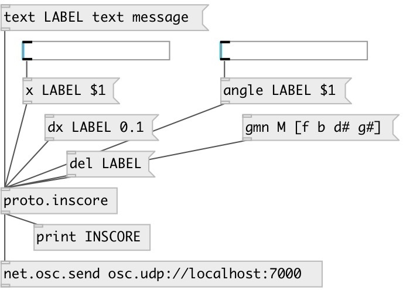

[index](index.html) :: [proto](category_proto.html)
---

# proto.inscore

###### INScore message creator

*доступно с версии:* 0.9.6

---

## методы:

* **text**
create text object at (0,0) position 
  __параметры:__
  - **NAME** object name 
    тип: symbol  
    обязательно: True  

  - **[ARGS]** content 
    тип: list  

* **del**
remove object 
  __параметры:__
  - **NAME** object name 
    тип: symbol  
    обязательно: True  

* **show**
show/hide object 
  __параметры:__
  - **NAME** object name 
    тип: symbol  
    обязательно: True  

  - **VAL** object state 
    тип: int  
    обязательно: True  

* **write**
text objects support writing in a stream-like way. 
  __параметры:__
  - **NAME** object name 
    тип: symbol  
    обязательно: True  

  - **ITEMS** added content 
    тип: list  
    обязательно: True  

* **x**
move object to new Y-coord 
  __параметры:__
  - **NAME** object name 
    тип: symbol  
    обязательно: True  

  - **[POS]** new X position 
    тип: float  

* **y**
move object to new Y-coord 
  __параметры:__
  - **NAME** object name 
    тип: symbol  
    обязательно: True  

  - **[POS]** new Y position 
    тип: float  

* **z**
move object to new Z-coord 
  __параметры:__
  - **NAME** object name 
    тип: symbol  
    обязательно: True  

  - **[POS]** new Z position 
    тип: float  

* **dx**
move object horizontally by specified X offset 
  __параметры:__
  - **NAME** object name 
    тип: symbol  
    обязательно: True  

  - **[POS]** X offset 
    тип: float  

* **dy**
move object vertically by specified Y offset 
  __параметры:__
  - **NAME** object name 
    тип: symbol  
    обязательно: True  

  - **[POS]** Y offset 
    тип: float  

* **dz**
move object vertically by specified Z offset 
  __параметры:__
  - **NAME** object name 
    тип: symbol  
    обязательно: True  

  - **[POS]** Z offset 
    тип: float  

* **xorigin**
set object X origin 
  __параметры:__
  - **NAME** object name 
    тип: symbol  
    обязательно: True  

  - **POS** X origin position 
    тип: float  
    обязательно: True  

* **yorigin**
set object Y origin 
  __параметры:__
  - **NAME** object name 
    тип: symbol  
    обязательно: True  

  - **POS** Y origin position 
    тип: float  
    обязательно: True  

* **width**
set object width 
  __параметры:__
  - **NAME** object name 
    тип: symbol  
    обязательно: True  

  - **[WD]** width 
    тип: float  

* **height**
set object width 
  __параметры:__
  - **NAME** object name 
    тип: symbol  
    обязательно: True  

  - **[WD]** height 
    тип: float  

* **angle**
rotate object 
  __параметры:__
  - **NAME** object name 
    тип: symbol  
    обязательно: True  

  - **ANGLE** rotation angle (clockwise) 
    тип: float  
    единица: deg  
    обязательно: True  

* **scale**
scale object 
  __параметры:__
  - **NAME** object name 
    тип: symbol  
    обязательно: True  

  - **VAL** value 
    тип: float  
    обязательно: True  

* **dscale**
relative object scale 
  __параметры:__
  - **NAME** object name 
    тип: symbol  
    обязательно: True  

  - **VAL** value 
    тип: float  
    обязательно: True  

* **font_size**
set object fontsize 
  __параметры:__
  - **NAME** object name 
    тип: symbol  
    обязательно: True  

  - **SIZE** fontsize 
    тип: float  
    обязательно: True  

* **font_weight**
set object font weight 
  __параметры:__
  - **NAME** object name 
    тип: symbol  
    обязательно: True  

  - **SIZE** weight 
    тип: symbol  
    обязательно: True  

* **color**
set object color 
  __параметры:__
  - **NAME** object name 
    тип: symbol  
    обязательно: True  

  - **VAL** color: RGB list of floats in [0-1] range or color name 
    тип: list  
    обязательно: True  

* **alpha**
set object alpha opacity 
  __параметры:__
  - **NAME** object name 
    тип: symbol  
    обязательно: True  

  - **VAL** alpha value 
    тип: float  
    обязательно: True  

* **gmn**
create Guido Music notation 
  __параметры:__
  - **NAME** object name 
    тип: symbol  
    обязательно: True  

  - **[NOTES]** Guido Music Notation 
    тип: list  

* **make_chord**
output guido chord as symbol 
  __параметры:__
  - **[NOTES]** guido notation 
    тип: list  

* **make_cluster**
output guido cluster as symbol 
  __параметры:__
  - **[NOTES]** guido notation 
    тип: list  

* **write_chord**
add chord to INScore 
  __параметры:__
  - **NAME** object name 
    тип: symbol  
    обязательно: True  

  - **[NOTES]** guido notation 
    тип: list  

* **gmn&lt;&lt;**
append Guido Music notation to object, can be called several times 
  __параметры:__
  - **NAME** object name 
    тип: symbol  
    обязательно: True  

  - **NOTES** Guido Music Notation 
    тип: list  
    обязательно: True  

* **rect**
create rectangle 
  __параметры:__
  - **NAME** object name 
    тип: symbol  
    обязательно: True  

  - **W** width 
    тип: float  
    обязательно: True  

  - **H** height 
    тип: float  
    обязательно: True  

* **ellipse**
create ellipse 
  __параметры:__
  - **NAME** object name 
    тип: symbol  
    обязательно: True  

  - **W** width 
    тип: float  
    обязательно: True  

  - **H** height 
    тип: float  
    обязательно: True  

* **file**
set object from file content 
  __параметры:__
  - **NAME** object name 
    тип: symbol  
    обязательно: True  

  - **URL** url 
    тип: symbol  
    обязательно: True  

## свойства:

* **@scene** 
Запросить/установить scene id 
_тип:_ int 
_минимальное значение:_ 0 
_по умолчанию:_ 0 

## входы:

* control input 
_тип:_ control

## выходы:

* osc send command 
_тип:_ control

## ключевые слова:

[inscore](keywords/inscore.html)

**Авторы:** Serge Poltavsky

**Лицензия:** GPL3 or later

