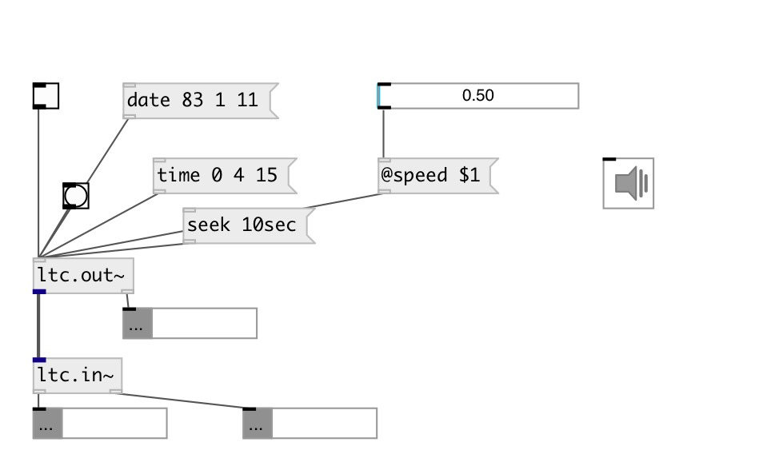

[index](index.html) :: [proto](category_proto.html)
---

# proto.ltc.out~

###### LTC encoder

*доступно с версии:* 0.9.7

---

## методы:

* **date**
set current date 
  __параметры:__
  - **YEAR** year 
    тип: int  
    обязательно: True  

  - **MONTH** month 
    тип: int  
    обязательно: True  

  - **DAY** day 
    тип: int  
    обязательно: True  

  - **[TIMEZONE]** timezone in +HHMM format 
    тип: symbol  

* **seek**
time seek 
  __параметры:__
  - **UNIT** relative position seek. If float or int - seek in frames, otherwise units are expected. Supported units are: day, hour, min, sec. E.g.: 1day, 3hour, 5min, 11sec etc. 
    тип: atom  
    обязательно: True  

* **time**
set current time 
  __параметры:__
  - **HOUR** hour 
    тип: int  
    обязательно: True  

  - **MIN** minute 
    тип: int  
    обязательно: True  

  - **SEC** second 
    тип: int  
    обязательно: True  

  - **[FRAME]** frame number 
    тип: int  

## свойства:

* **@on** 
Запросить/установить encoder state 
_тип:_ bool 
_по умолчанию:_ 0 

* **@volume** 
Запросить/установить output signal level 
_тип:_ float 
_единица:_ db 
_диапазон:_ -42..0 
_по умолчанию:_ -3 

* **@fps** 
Запросить/установить frames per second rate. Supported values are: 24, 25, 29.97, 30. 
_тип:_ float 
_по умолчанию:_ 25 

* **@speed** 
Запросить/установить playing speed 
_тип:_ float 
_по умолчанию:_ 1 

* **@filter** 
Запросить/установить output signal filtering. LTC should have a rise time of 40us+/-10 us. If you
want a perfect square wave, set to 0 
_тип:_ float 
_диапазон:_ 0..500 
_по умолчанию:_ 0 

## входы:

* output current time to second outlet 
_тип:_ control

## выходы:

* LTC signal 
_тип:_ audio
* list: HOUR MINUTE SECOND FRAME 
_тип:_ control

## ключевые слова:

[parser](keywords/parser.html)
[ltc](keywords/ltc.html)

**Смотрите также:**
[\[ltc.in~\]](ltc.in~.html)

**Авторы:** Serge Poltavsky

**Лицензия:** GPL3 or later

