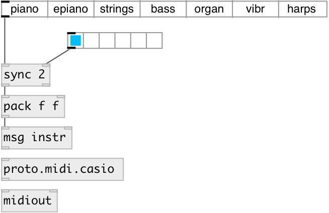

[index](index.html) :: [proto](category_proto.html)
---

# proto.midi.casio

###### Casio Privia MIDI control

*доступно с версии:* 0.9.5

---

## информация
Note: only PX160 model supported at this moment

## методы:

* **instr**
send Note On message 
  __параметры:__
  - **[CH]** midi channel 
    тип: int  

  - **NAME** instrument name 
    тип: symbol  
    обязательно: True  

  - **TYPE** instrument type. for &#39;piano&#39;: concert|modern|classic|mellow|bright|0..4, for &#39;epiano&#39;: 0|1|fm|2|3|60, for &#39;strings&#39;: 0|1, for &#39;bass&#39;: 0, for &#39;organ&#39;: pipe|jass|elec1|elec2|0..3, for &#39;vibr&#39; and &#39;haprs&#39;: 0 
    тип: atom  
    обязательно: True  

* **rev_type**
set reverb type 
  __параметры:__
  - **TYPE** reverb type 
    тип: int  
    обязательно: True  

* **rev_time**
set reverb time 
  __параметры:__
  - **AMOUNT** reverb time 
    тип: int  
    обязательно: True  

## свойства:

* **@model** 
Запросить/установить device model 
_тип:_ symbol 
_по умолчанию:_ px160 

## входы:

*   
_тип:_ control

## выходы:

* float: raw midi output 
_тип:_ control

## ключевые слова:

[parser](keywords/parser.html)
[midi](keywords/midi.html)
[casio](keywords/casio.html)

**Авторы:** Serge Poltavsky

**Лицензия:** GPL3 or later

