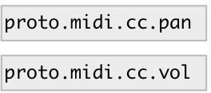

[index](index.html) :: [proto](category_proto.html)
---

# proto.midi.cc

###### raw midi CC encoder/parser

*доступно с версии:* 0.9.4

---

## методы:

* **bank**
send CC Bank Select 
  __параметры:__
  - **[CH]** midi channel 
    тип: int  

  - **BANK** bank 
    тип: int  
    обязательно: True  

* **bank:i**
same as [bank( 

* **bank:lsb**
send CC Bank Select LSB 
  __параметры:__
  - **[CH]** midi channel 
    тип: int  

  - **BANK** bank LSB 
    тип: int  
    обязательно: True  

* **bank:msb**
send CC Bank Select MSB 
  __параметры:__
  - **[CH]** midi channel 
    тип: int  

  - **BANK** bank MSB 
    тип: int  
    обязательно: True  

* **bendsens**
send Pitch bend sensitivity message 
  __параметры:__
  - **CH** midi channel 
    тип: int  
    обязательно: True  

* **exp.**
send fine CC Expression message 
  __параметры:__
  - **CHAN** midi channel 
    тип: int  
    обязательно: True  

  - **VAL** expression value 
    тип: int  
    обязательно: True  

* **exp:f**
send CC normalized Expression message 
  __параметры:__
  - **CHAN** midi channel 
    тип: int  
    обязательно: True  

  - **VAL** expression value 
    тип: float  
    обязательно: True  

* **exp:i**
send 14-bit CC Expression message 
  __параметры:__
  - **CHAN** midi channel 
    тип: int  
    обязательно: True  

  - **VAL** expression 
    тип: int  
    обязательно: True  

* **exp~**
send coarse CC Expression message 
  __параметры:__
  - **CHAN** midi channel 
    тип: int  
    обязательно: True  

  - **VAL** expression value 
    тип: int  
    обязательно: True  

* **hold**
send CC Hold pedal message 
  __параметры:__
  - **[CHAN]** midi channel 
    тип: int  

  - **BOOL** on/off value 
    тип: int  
    обязательно: True  

* **mod.**
send fine CC Modulation message 
  __параметры:__
  - **CHAN** midi channel 
    тип: int  
    обязательно: True  

  - **VAL** modulation value 
    тип: int  
    обязательно: True  

* **mod:f**
send CC normalized Modulation message 
  __параметры:__
  - **CHAN** midi channel 
    тип: int  
    обязательно: True  

  - **VAL** modulation value 
    тип: float  
    обязательно: True  

* **mod:i**
send 14-bit CC Modulation message 
  __параметры:__
  - **CHAN** midi channel 
    тип: int  
    обязательно: True  

  - **VAL** modulation 
    тип: int  
    обязательно: True  

* **mod~**
send coarse CC Modulation message 
  __параметры:__
  - **CHAN** midi channel 
    тип: int  
    обязательно: True  

  - **VAL** modulation value 
    тип: int  
    обязательно: True  

* **notes_off**
send All Notes Off message 
  __параметры:__
  - **CH** midi channel. if missing or -1: send to all channels 
    тип: int  
    обязательно: True  

* **pan.**
send Pan CC fine message 
  __параметры:__
  - **CHAN** midi channel 
    тип: int  
    обязательно: True  

  - **PAN** pan value 
    тип: int  
    обязательно: True  

* **pan:f**
send CC Pan messages (coarse and fine) 
  __параметры:__
  - **CHAN** midi channel 
    тип: int  
    обязательно: True  

  - **PAN** pan value. -1 means left, 0: center, +1: right 
    тип: float  
    обязательно: True  

* **pan:i**
send Pan CC message. Args: CHAN PAN(0..0x3fff) or CHAN MSB(0..127) LSB(0..127).
In case of 14 bit value 0 means left, 0x2000: center and 0x3fff: right 

* **panic**
send All Notes Off message 
  __параметры:__
  - **CH** midi channel. if missing or -1: send to all channels 
    тип: int  
    обязательно: True  

* **pan~**
send Pan CC coarse message 
  __параметры:__
  - **CHAN** midi channel 
    тип: int  
    обязательно: True  

  - **PAN** pan value 
    тип: int  
    обязательно: True  

* **portamento**
send CC portamento message 
  __параметры:__
  - **[CHAN]** midi channel 
    тип: int  

  - **VALUE** portamento amount 
    тип: int  
    обязательно: True  

* **portswitch**
send CC portamento switch message 
  __параметры:__
  - **[CHAN]** midi channel 
    тип: int  

  - **BOOL** on/off value 
    тип: int  
    обязательно: True  

* **sostenuto**
send CC sostenuto pedal message 
  __параметры:__
  - **[CHAN]** midi channel 
    тип: int  

  - **BOOL** on/off value 
    тип: int  
    обязательно: True  

* **sound_off**
send All Sound Off message 
  __параметры:__
  - **[CH]** midi channel. if missing or -1: send to all channels 
    тип: int  

* **tune.**
send RPN fine tuning request (in cents) 
  __параметры:__
  - **[CH]** midi channel 
    тип: int  

  - **CENTS** tuning in cents 
    тип: float  
    обязательно: True  

* **tune:c**
send RPN fine tuning request (in cents) 
  __параметры:__
  - **[CH]** midi channel 
    тип: int  

  - **CENTS** tuning in cents 
    тип: float  
    обязательно: True  

* **tune:s**
send RPN tuning request in semitones 
  __параметры:__
  - **[CH]** midi channel 
    тип: int  

  - **SEMI** tuning in semitones 
    тип: float  
    обязательно: True  

* **tunebank**
send RPN tune bank select 
  __параметры:__
  - **[CH]** midi channel 
    тип: int  

  - **BANK** tuning bank 
    тип: int  
    обязательно: True  

* **tuneprog**
send RPN tune prog change 
  __параметры:__
  - **[CH]** midi channel 
    тип: int  

  - **PROG** tuning program 
    тип: int  
    обязательно: True  

* **tunesel**
send RPN tune select 
  __параметры:__
  - **[CH]** midi channel 
    тип: int  

  - **BANK** tuning bank 
    тип: int  
    обязательно: True  

  - **PROG** tuning program 
    тип: int  
    обязательно: True  

* **tune~**
send RPN coarse tuning request (in semitones) 
  __параметры:__
  - **[CH]** midi channel 
    тип: int  

  - **SEMI** tuning in semitones 
    тип: int  
    обязательно: True  

* **volume.**
send fine CC Volume message 
  __параметры:__
  - **CHAN** midi channel 
    тип: int  
    обязательно: True  

  - **VOL** pan value 
    тип: int  
    обязательно: True  

* **volume:f**
send CC normalized Volume message 
  __параметры:__
  - **CHAN** midi channel 
    тип: int  
    обязательно: True  

  - **VOL** volume value 
    тип: float  
    обязательно: True  

* **volume:i**
send 14-bit CC Volume message 
  __параметры:__
  - **CHAN** midi channel 
    тип: int  
    обязательно: True  

  - **VOL** value 
    тип: int  
    обязательно: True  

* **volume~**
send coarse CC Volume message 
  __параметры:__
  - **CHAN** midi channel 
    тип: int  
    обязательно: True  

  - **VOL** pan value 
    тип: int  
    обязательно: True  

## свойства:

* **@list** (initonly)
Запросить/установить output as list 
_тип:_ flag 

## входы:

* raw midi input bytes 
_тип:_ control

## выходы:

* float: raw midi output or parsed messages with selector (output format is the same as for corresponding methods) 
_тип:_ control

## ключевые слова:

[parser](keywords/parser.html)
[midi](keywords/midi.html)

**Авторы:** Serge Poltavsky

**Лицензия:** GPL3 or later

