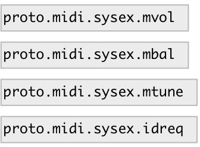

[index](index.html) :: [proto](category_proto.html)
---

# proto.midi.sysex

###### raw midi SYSex encoder/parser

*доступно с версии:* 0.9.4

---

## методы:

* **id_request**
send Identity Request SysEx message 

* **mbal:f**
set device master balance 
  __параметры:__
  - **PAN** balance 
    тип: float  
    обязательно: True  

* **mtune**
set device master tuning in float semitones (combination of coarse and fine
tune) 
  __параметры:__
  - **V** tuning 
    тип: float  
    единица: semitone  
    обязательно: True  

* **mtune.**
set device master fine tuning in cents 
  __параметры:__
  - **V** tuning 
    тип: int  
    единица: cent  
    обязательно: True  

* **mtune~**
set device master coarse tuning in semitones 
  __параметры:__
  - **V** tuning 
    тип: int  
    единица: semitone  
    обязательно: True  

* **mvolume**
set device master volume 
  __параметры:__
  - **LEVEL** volume level 
    тип: float  
    обязательно: True  

## входы:

* raw midi input bytes 
_тип:_ control

## выходы:

* float: raw midi output or parsed messages with selector (output format is the same as for corresponding methods) 
_тип:_ control

## ключевые слова:

[parser](keywords/parser.html)
[midi](keywords/midi.html)

**Авторы:** Serge Poltavsky

**Лицензия:** GPL3 or later

