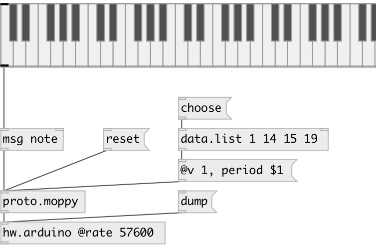

[index](index.html) :: [proto](category_proto.html)
---

# proto.moppy

###### protocol for Musical flOPPY controller

*доступно с версии:* 0.9.5

---

## методы:

* **ping**
send ping request to all devices 

* **note**
see noteon 

* **noteon**
play note 
  __параметры:__
  - **[CHAN]** optional floppy id (overrides @floppy property) 
    тип: int  

  - **NOTE** MIDI note 
    тип: int  
    обязательно: True  

  - **VEL** note velocity (if 0 - turns note off, otherwise ignored) 
    тип: int  
    обязательно: True  

* **noteoff**
note off message 
  __параметры:__
  - **[CHAN]** optional floppy id (overrides @floppy property) 
    тип: int  

  - **NOTE** MIDI note 
    тип: int  
    обязательно: True  

* **reset**
reset moppy device. 
  __параметры:__
  - **[all]** reset all devices 
    тип: symbol  

* **bend:f**
note pitchbend 
  __параметры:__
  - **VAL** pitch bend 
    тип: float  
    обязательно: True  

* **freq**
set floppy frequency. Note: moppy.v1 version only. 
  __параметры:__
  - **[CHAN]** optional floppy id (overrides @floppy property) 
    тип: int  

  - **FREQ** freq 
    тип: float  
    единица: Hz  
    обязательно: True  

* **period**
directly set floppy drive period. Note: moppy.v1 version only. 
  __параметры:__
  - **[CHAN]** optional floppy id (overrides @floppy property) 
    тип: int  

  - **TIME** period in microseconds 
    тип: int  
    обязательно: True  

## свойства:

* **@v** 
Запросить/установить MOPPY protocol version 
_тип:_ int 
_варианты:_ 2, 1 
_по умолчанию:_ 2 

* **@device** 
Запросить/установить moppy device ID 
_тип:_ int 
_диапазон:_ 1..255 
_по умолчанию:_ 1 

* **@floppy** 
Запросить/установить floppy ID on moppy device 
_тип:_ int 
_диапазон:_ 1..16 
_по умолчанию:_ 1 

## входы:

* commands 
_тип:_ control

## выходы:

* list: output to moppy 
_тип:_ control

## ключевые слова:

[floppy](keywords/floppy.html)
[diy](keywords/diy.html)
[serial](keywords/serial.html)

**Авторы:** Serge Poltavsky

**Лицензия:** GPL3 or later

