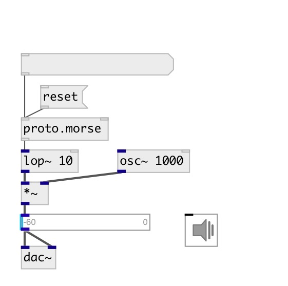

[index](index.html) :: [proto](category_proto.html)
---

# proto.morse

###### Morse encoder

*доступно с версии:* 0.9.7

---

## аргументы:

* **DOT**
dot length 
_тип:_ float 
_единица:_ ms 

## методы:

* **reset**
reset encoder 

## свойства:

* **@dot** 
Запросить/установить dot length 
_тип:_ float 
_единица:_ ms 
_диапазон:_ 5..1000 
_по умолчанию:_ 100 

* **@letter** 
Запросить/установить space between letters in dot units 
_тип:_ int 
_диапазон:_ 2..20 
_по умолчанию:_ 3 

* **@word** 
Запросить/установить space between words in dot units 
_тип:_ int 
_диапазон:_ 2..20 
_по умолчанию:_ 5 

* **@external** 
Запросить/установить use external clock 
_тип:_ bool 
_по умолчанию:_ 0 

## входы:

* add words to encoder 
_тип:_ control
* external clock 
_тип:_ control

## выходы:

* float: 1 or 0 
_тип:_ control

## ключевые слова:

[morse](keywords/morse.html)
[proto](keywords/proto.html)

**Авторы:** Serge Poltavsky

**Лицензия:** GPL3 or later

