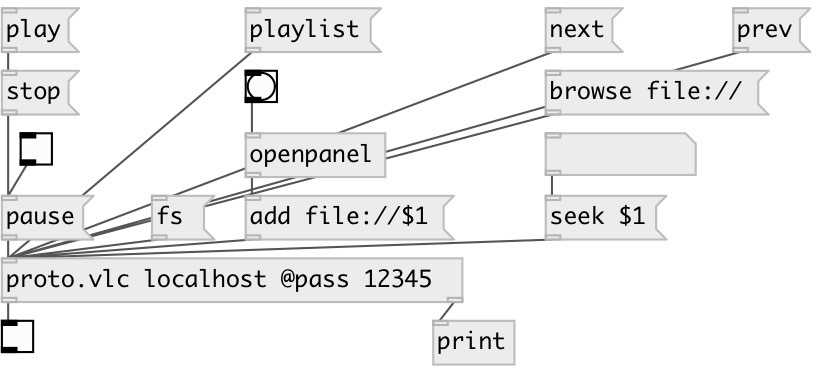

[index](index.html) :: [proto](category_proto.html)
---

# proto.vlc

###### VLC video player control over HTTP

*доступно с версии:* 0.9.5

---

## информация
VLC video player control

## аргументы:

* **HOST**
hostname on that VLC player is running on 
_тип:_ symbol 

## методы:

* **add**
add URI to playlist 
  __параметры:__
  - **URI** resource URI (file:// or http:// or camera://) 
    тип: symbol  
    обязательно: True  

* **browse**
browse resource 
  __параметры:__
  - **URI** resource URI (file:///path) 
    тип: symbol  
    обязательно: True  

* **clear**
clear playlist 

* **delete**
delete item from playlist 
  __параметры:__
  - **[ID]** playlist entry id 
    тип: int  

* **fs**
toggle VLC fullscreen mode 

* **loop**
toggle loop 

* **next**
go to the next entry on the playlist 

* **pause**
pause/resume playback 
  __параметры:__
  - **[VAL]** 1 or omitted: pause, 0: resume 
    тип: int  

* **play**
start playback 

* **playlist**
request playlist. Output as dict to second outlet 

* **prev**
go to the previous entry on the playlist 

* **seek**
seek playback position 
  __параметры:__
  - **TIME** absolute time position (int value in seconds or 00h:00m:00s) or relative offset (+val, -val) 
    тип: atom  
    обязательно: True  

* **status**
request playback status. Output as dict to second outlet 

* **stop**
stop playback 

* **volume**
set playing volume 
  __параметры:__
  - **VAL** absolute value in percent or relative change +VOL or -VOL 
    тип: atom  
    обязательно: True  

## свойства:

* **@host** 
Запросить/установить hostname on that VLC player is running on 
_тип:_ symbol 
_по умолчанию:_ localhost 

* **@port** 
Запросить/установить hostname on that VLC player is running on 
_тип:_ int 
_диапазон:_ 1..32768 
_по умолчанию:_ 8080 

* **@pass** 
Запросить/установить VLC http password 
_тип:_ atom 

## входы:

* commands 
_тип:_ control

## выходы:

* int: 1 on success, 0 on error 
_тип:_ control
* dict: response data 
_тип:_ control

## ключевые слова:

[mpv](keywords/mpv.html)
[mplayer](keywords/mplayer.html)

**Авторы:** Serge Poltavsky

**Лицензия:** GPL3 or later

