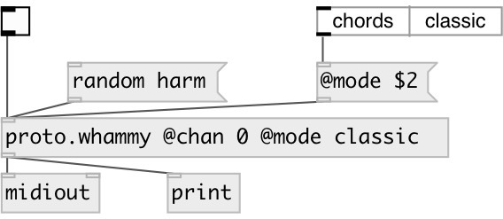

[index](index.html) :: [proto](category_proto.html)
---

# proto.whammy

###### Control for Digitech Whammy pedal

*доступно с версии:* 0.9.5

---

## аргументы:

* **MODE**
pedal mode (should correspond to hardware switch on pedal) 
_тип:_ symbol 

* **ACTIVE**
pedal initial state 
_тип:_ bool 

## методы:

* **toggle**
toggle pedal on/off 

* **random**
choose random preset 
  __параметры:__
  - **MODE** if &#39;whammy&#39; - select random preset from &#39;whammy&#39; modes (right pedal side), if &#39;harm&#39; - select random preset from harmonizer modes (left pedal side), if &#39;detune&#39; - select random detune mode. If not specified - select random mode from all categories. 
    тип: symbol  
    обязательно: True  

  - **[STATE]** pedal state (on/off) 
    тип: int  

* **reset**
turn off pedal and select default preset 

* **set IDX**
set preset by index 
  __параметры:__
  - **IDX** preset index 
    тип: int  
    обязательно: True  

  - **[STATE]** pedal state (on/off) 
    тип: int  

* **set NAME**
set preset by name 
  __параметры:__
  - **NAME** preset name 
    тип: symbol  
    обязательно: True  

  - **[STATE]** pedal state (on/off) 
    тип: int  

* **set UP DOWN**
set preset by transpose range. 
  __параметры:__
  - **UP** up range 
    тип: int  
    обязательно: True  

  - **DOWN** down range 
    тип: int  
    обязательно: True  

  - **[STATE]** pedal state (on/off) 
    тип: int  

* **next**
select next preset 
  __параметры:__
  - **[N]** positive step or &#39;random&#39; 
    тип: atom  

* **prev**
select previous preset 
  __параметры:__
  - **[N]** positive step or &#39;random&#39; 
    тип: atom  

## свойства:

* **@active** 
Запросить/установить pedal state 
_тип:_ bool 
_по умолчанию:_ 1 

* **@mode** 
Запросить/установить pedal mode (should correspond to hardware switch on pedal) 
_тип:_ symbol 
_варианты:_ chords, classic 
_по умолчанию:_ classic 

* **@chan** 
Запросить/установить output Midi channel 
_тип:_ int 
_диапазон:_ 0..15 
_по умолчанию:_ 0 

* **@seed** 
Запросить/установить random seed 
_тип:_ int 
_минимальное значение:_ 0 
_по умолчанию:_ 0 

* **@chords** 
Запросить/установить alias for @mode chords 
_тип:_ alias 

* **@classic** 
Запросить/установить alias for @mode classic 
_тип:_ alias 

## входы:

* 1: turn on, 0: turn off pedal 
_тип:_ control

## выходы:

* float stream: raw midi output 
_тип:_ control

## ключевые слова:

[parser](keywords/parser.html)
[midi](keywords/midi.html)
[whammy](keywords/whammy.html)

**Авторы:** Serge Poltavsky

**Лицензия:** GPL3 or later

