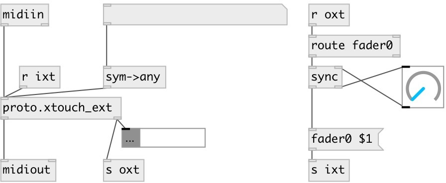

[index](index.html) :: [proto](category_proto.html)
---

# proto.xtouch_ext

###### Behringer XTouch Extender XMidi protocol

*доступно с версии:* 0.9.1

---

## информация
Behringer XTouch Extender XMidi

## методы:

* **lcd**
set LCD text 
  __параметры:__
  - **CHAN** channel index, max value is NUM_SCENES * 8 
    тип: int  
    обязательно: True  

  - **UPPER** upper display text 
    тип: atom  
    обязательно: True  

  - **LOWER** lower display text 
    тип: atom  
    обязательно: True  

* **lcd0**
set upper LCD text 
  __параметры:__
  - **CHAN** channel index, max value is NUM_SCENES * 8 
    тип: int  
    обязательно: True  

  - **STR** upper display text 
    тип: list  
    обязательно: True  

* **lcd1**
set lower LCD text 
  __параметры:__
  - **CHAN** channel index, max value is NUM_SCENES * 8 
    тип: int  
    обязательно: True  

  - **STR** lower display text 
    тип: list  
    обязательно: True  

* **ulcd**
set several upper LCD text 
  __параметры:__
  - **CHAN** channel index, max value is NUM_SCENES * 8 
    тип: int  
    обязательно: True  

  - **ATOMS** upper display texts, each atom per display 
    тип: list  
    обязательно: True  

* **llcd**
set several lower LCD text 
  __параметры:__
  - **CHAN** channel index, max value is NUM_SCENES * 8 
    тип: int  
    обязательно: True  

  - **ATOMS** lower display texts, each atom per display 
    тип: list  
    обязательно: True  

* **lcd_align**
set all texts alignment. Note: you should set this before setting upper display
text 
  __параметры:__
  - **CHAN** &#39;all&#39;, &#39;scene&#39; or channel index, max value is NUM_SCENES * 8 
    тип: atom  
    обязательно: True  

  - **ALIGN** align name. Valid names are: left, right, center, justify and auto 
    тип: list  
    обязательно: True  

* **lcd_align0**
set upper text alignment. Note: you should set this before setting upper
display text 
  __параметры:__
  - **CHAN** &#39;all&#39;, &#39;scene&#39; or channel index, max value is NUM_SCENES * 8 
    тип: atom  
    обязательно: True  

  - **ALIGN** align name. Valid names are: left, right, center, justify and auto 
    тип: list  
    обязательно: True  

* **lcd_align1**
set lower text alignment. Note: you should set this before setting lower
display text 
  __параметры:__
  - **CHAN** &#39;all&#39;, &#39;scene&#39; or channel index, max value is NUM_SCENES * 8 
    тип: atom  
    обязательно: True  

  - **ALIGN** align name. Valid names are: left, right, center, justify and auto 
    тип: list  
    обязательно: True  

* **lcd_mode**
set lcd background/highlight mode. 
  __параметры:__
  - **CHAN** &#39;all&#39;, &#39;scene&#39; or channel index, max value is NUM_SCENES * 8 
    тип: atom  
    обязательно: True  

  - **MODE** mod values. 0: display is inverted, 1: upper is inverted, 2: lower is inverted, 3: none in inverted 
    тип: list  
    обязательно: True  

* **lcd_color**
set display color 
  __параметры:__
  - **CHAN** &#39;all&#39;, &#39;scene&#39; or channel index, max value is NUM_SCENES * 8 
    тип: atom  
    обязательно: True  

  - **COLOR** list of color name or color indexes. Valid color names are: black, red, green, blue, yellow, magenta, cyan, white and random. Valid color indexes are in 0..7 range 
    тип: list  
    обязательно: True  

* **lcd_enum0**
set all upper display text with incremental enumeration 
  __параметры:__
  - **[PREFIX]** name prefix 
    тип: atom  

* **lcd_enum1**
set all lower display text with incremental enumeration 
  __параметры:__
  - **[PREFIX]** name prefix 
    тип: atom  

* **rec**
set rec buttons 
  __параметры:__
  - **CHAN** &#39;all&#39;, &#39;scene&#39; or channel index, max value is NUM_SCENES * 8 
    тип: atom  
    обязательно: True  

  - **X** button value(s) 
    тип: list  
    обязательно: True  

* **rec?**
get rec button, output to second outlet in format [rec? IDX VALUE( 
  __параметры:__
  - **CHAN** channel index, max value is NUM_SCENES * 8 
    тип: atom  
    обязательно: True  

* **solo**
set solo buttons 
  __параметры:__
  - **CHAN** &#39;all&#39;, &#39;scene&#39; or channel index, max value is NUM_SCENES * 8 
    тип: atom  
    обязательно: True  

  - **X** button value(s) 
    тип: list  
    обязательно: True  

* **solo?**
get solo button, output to second outlet in format [solo? IDX VALUE( 
  __параметры:__
  - **CHAN** channel index, max value is NUM_SCENES * 8 
    тип: atom  
    обязательно: True  

* **mute**
set mute buttons 
  __параметры:__
  - **CHAN** &#39;all&#39;, &#39;scene&#39; or channel index, max value is NUM_SCENES * 8 
    тип: atom  
    обязательно: True  

  - **X** button value(s) 
    тип: list  
    обязательно: True  

* **mute?**
get mute button, output to second outlet in format [mute? IDX VALUE( 
  __параметры:__
  - **CHAN** channel index, max value is NUM_SCENES * 8 
    тип: atom  
    обязательно: True  

* **select**
set select buttons 
  __параметры:__
  - **CHAN** &#39;all&#39;, &#39;scene&#39; or channel index, max value is NUM_SCENES * 8 
    тип: atom  
    обязательно: True  

  - **X** button value(s) 
    тип: list  
    обязательно: True  

* **select?**
get select button, output to second outlet in format [select? IDX VALUE( 
  __параметры:__
  - **CHAN** channel index, max value is NUM_SCENES * 8 
    тип: atom  
    обязательно: True  

* **fader**
set fader value 
  __параметры:__
  - **CHAN** &#39;all&#39;, &#39;scene&#39; or channel index, max value is NUM_SCENES * 8 
    тип: atom  
    обязательно: True  

  - **X** fader value(s) 
    тип: list  
    обязательно: True  

* **fader?**
get fader value, output to second outlet in format [fader? IDX VALUE( 
  __параметры:__
  - **CHAN** channel index, max value is NUM_SCENES * 8 
    тип: atom  
    обязательно: True  

* **knob**
set knob value 
  __параметры:__
  - **CHAN** &#39;all&#39;, &#39;scene&#39; or channel index, max value is NUM_SCENES * 8 
    тип: atom  
    обязательно: True  

  - **X** fader value(s) 
    тип: list  
    обязательно: True  

* **knob?**
get knob value, output to second outlet in format [knob? IDX VALUE( 
  __параметры:__
  - **CHAN** channel index, max value is NUM_SCENES * 8 
    тип: atom  
    обязательно: True  

* **rec_mode**
set rec buttons toggle mode 
  __параметры:__
  - **CHAN** &#39;all&#39;, &#39;scene&#39; or channel index, max value is NUM_SCENES * 8 
    тип: atom  
    обязательно: True  

  - **X** values list: -1, 0 or 1 
    тип: list  
    обязательно: True  

* **solo_mode**
set solo buttons toggle mode 
  __параметры:__
  - **CHAN** &#39;all&#39;, &#39;scene&#39; or channel index, max value is NUM_SCENES * 8 
    тип: atom  
    обязательно: True  

  - **X** values list: -1, 0 or 1 
    тип: list  
    обязательно: True  

* **mute_mode**
set mute buttons toggle mode 
  __параметры:__
  - **CHAN** &#39;all&#39;, &#39;scene&#39; or channel index, max value is NUM_SCENES * 8 
    тип: atom  
    обязательно: True  

  - **X** values list: -1, 0 or 1 
    тип: list  
    обязательно: True  

* **select_mode**
set select buttons toggle mode 
  __параметры:__
  - **CHAN** &#39;all&#39;, &#39;scene&#39; or channel index, max value is NUM_SCENES * 8 
    тип: atom  
    обязательно: True  

  - **X** values list: -1, 0 or 1 
    тип: list  
    обязательно: True  

* **vu**
set VU meter indicator 
  __параметры:__
  - **CHAN** channel index, max value is NUM_SCENES * 8 
    тип: int  
    обязательно: True  

  - **DB** level in decibels, in -144..0 range 
    тип: float  
    обязательно: True  

* **reset**
reset all knobs, faders and buttons to 0, vu to lowest values. Do not change
display texts 

## свойства:

* **@n** (readonly)
Получить number of scenes 
_тип:_ int 
_диапазон:_ 1..32 
_по умолчанию:_ 2 

* **@scene** (readonly)
Получить current scene 
_тип:_ int 
_минимальное значение:_ 0 
_по умолчанию:_ 0 

## входы:

* raw midi input 
_тип:_ control

## выходы:

* raw midi output to behringer device 
_тип:_ control
* control messages from device 
_тип:_ control

## ключевые слова:

[xtouch](keywords/xtouch.html)
[behringer](keywords/behringer.html)

**Авторы:** Serge Poltavsky

**Лицензия:** GPL3 or later

