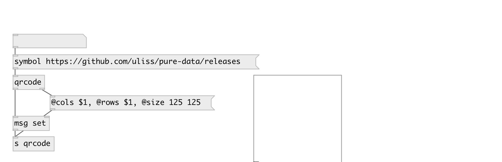

[index](index.html) :: [misc](category_misc.html)
---

# qrcode

###### QR code generator

*доступно с версии:* 0.9.7

---

## аргументы:

* **VALUE**
initial string value 
_тип:_ symbol 

## свойства:

* **@value** 
Запросить/установить string value 
_тип:_ symbol 

* **@quality** 
Запросить/установить encoding quality 
_тип:_ symbol 
_варианты:_ low, medium, quartile, high 
_по умолчанию:_ low 

* **@low** 
Запросить/установить alias to @quality low 
_тип:_ alias 

* **@medium** 
Запросить/установить alias to @quality medium 
_тип:_ alias 

* **@quartile** 
Запросить/установить alias to @quality quartile 
_тип:_ alias 

* **@high** 
Запросить/установить alias to @quality high 
_тип:_ alias 

## входы:

* output encoded data 
_тип:_ control

## выходы:

* list of 1 and 0 
_тип:_ control
* int: qr code size 
_тип:_ control

## ключевые слова:

[qrcode](keywords/qrcode.html)

**Авторы:** Serge Poltavsky

**Лицензия:** GPL3 or later

