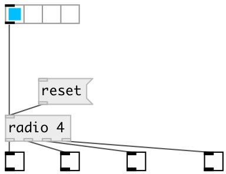

[index](index.html) :: [base](category_base.html)
---

# radio

###### float index to outlet values as radio switch

*доступно с версии:* 0.6

---

## аргументы:

* **N**
number of outlets 
_тип:_ int 

## методы:

* **reset**
output zeroes to all outlets 

## свойства:

* **@n** 
Получить/установить number of outlets 
_тип:_ int 
_диапазон:_ 2..24 
_по умолчанию:_ 2 

## входы:

* index 
_тип:_ control

## выходы:

* first output 
_тип:_ control
* first output 
_тип:_ control

## ключевые слова:

[radio](keywords/radio.html)

**Смотрите также:**
[\[hradio\]](hradio.html)

**Авторы:** Serge Poltavsky

**Лицензия:** GPL3 or later

