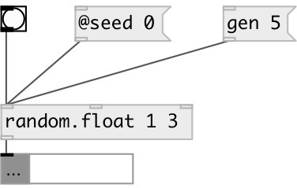

[index](index.html) :: [random](category_random.html)
---

# random.float

###### uniform random float generator in specified range

*доступно с версии:* 0.1

---

## информация
generates a random floating-point value uniformly distributed in the range [min..max) Use @seed property to get reproducible sequences. If @seed property was not explicitly set or specified, uses generator initialized with current time. Algorithm: 32-bit Mersenne Twister by Matsumoto and Nishimura, 1998

## аргументы:

* **ARG**
@min=ARG[0], @max=ARG[1], in case of signle arg: @min=0, @max=ARG[0] 
_тип:_ list 

## методы:

* **gen**
generate list of random floats with specified length 
  __параметры:__
  - **N** list length 
    тип: int  
    обязательно: True  

## свойства:

* **@min** 
Получить/установить random range lower bound 
_тип:_ float 
_по умолчанию:_ 0 

* **@max** 
Получить/установить random range upper bound 
_тип:_ float 
_по умолчанию:_ 1 

* **@seed** 
Получить/установить generator seed 
_тип:_ int 
_минимальное значение:_ 0 
_по умолчанию:_ 0 

## входы:

* generate new number 
_тип:_ control
* set @min property 
_тип:_ control
* set @max property 
_тип:_ control

## выходы:

* float ot list: result value 
_тип:_ control

## ключевые слова:

[random](keywords/random.html)
[float](keywords/float.html)

**Смотрите также:**
[\[random.int\]](random.int.html)
[\[random.gauss\]](random.gauss.html)

**Авторы:** Serge Poltavsky

**Лицензия:** GPL3 or later

