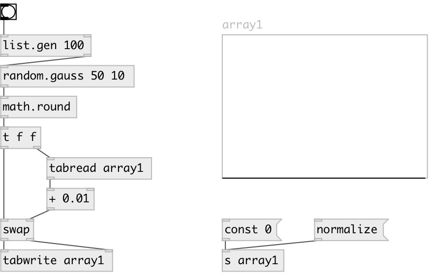

[index](index.html) :: [random](category_random.html)
---

# random.gauss

###### gaussian random distribution

*доступно с версии:* 0.1

---

## информация
Generates random value that has gaussian distribution. It has the shape of a bell curve and characterized by two parameters, mu and sigma. The center of the density function, mu, is the mean of the random variable. The spread of the density function is measured by a parameter called *standard deviation* or sigma. 68.26% of all results will occur in the interval with width +-SIGMA, centered by the mean; the random variable is unbounded, both as above and below the mean. 99.74% of all results fall within +-3 SIGMA. Use @seed property to get reproducible sequences. If @seed property was not explicitly set or specified, uses generator initialized with current time.

## аргументы:

* **MU**
the mean 
_тип:_ float 

* **SIGMA**
the standard deviation 
_тип:_ float 

## свойства:

* **@mu** 
Запросить/установить the mean 
_тип:_ float 
_по умолчанию:_ 0 

* **@sigma** 
Запросить/установить the standard deviation 
_тип:_ float 
_минимальное значение:_ 0 
_по умолчанию:_ 0 

* **@seed** 
Запросить/установить generator seed 
_тип:_ int 
_минимальное значение:_ 0 
_по умолчанию:_ 0 

## входы:

* generates random number 
_тип:_ control

## выходы:

* result value 
_тип:_ control

## ключевые слова:

[gauss](keywords/gauss.html)
[random](keywords/random.html)

**Смотрите также:**
[\[random.float\]](random.float.html)
[\[random.int\]](random.int.html)

**Авторы:** Serge Poltavsky

**Лицензия:** GPL3 or later

