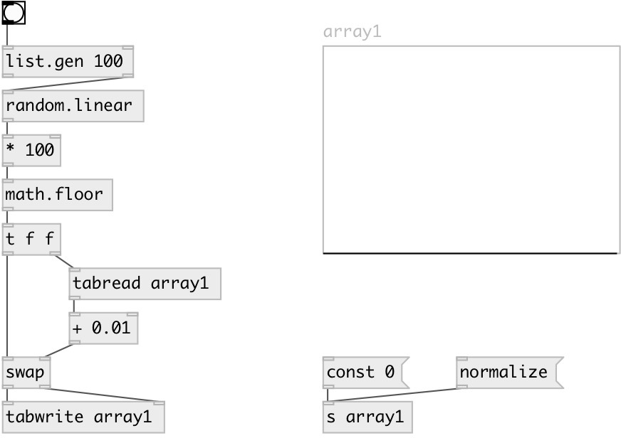

[index](index.html) :: [random](category_random.html)
---

# random.linear

###### random linear distribution

*доступно с версии:* 0.4

---

## информация
Generates random number in interval [@v0, @v1) with linear distribution [@p0, @p1) Use @seed property to get reproducible sequences. If @seed property was not explicitly set or specified, uses generator initialized with current time.

## свойства:

* **@v0** 
Запросить/установить begin of value interval 
_тип:_ float 
_по умолчанию:_ 0 

* **@v1** 
Запросить/установить end of value interval 
_тип:_ float 
_по умолчанию:_ 1 

* **@p0** 
Запросить/установить probability at begin 
_тип:_ float 
_по умолчанию:_ 1 

* **@p1** 
Запросить/установить probability at end 
_тип:_ float 
_по умолчанию:_ 0 

* **@seed** 
Запросить/установить generator seed 
_тип:_ int 
_минимальное значение:_ 0 
_по умолчанию:_ 0 

## входы:

* generates random number 
_тип:_ control

## выходы:

* result value 
_тип:_ control

## ключевые слова:

[linear](keywords/linear.html)
[random](keywords/random.html)

**Смотрите также:**
[\[random.float\]](random.float.html)
[\[random.int\]](random.int.html)

**Авторы:** Serge Poltavsky

**Лицензия:** GPL3 or later

