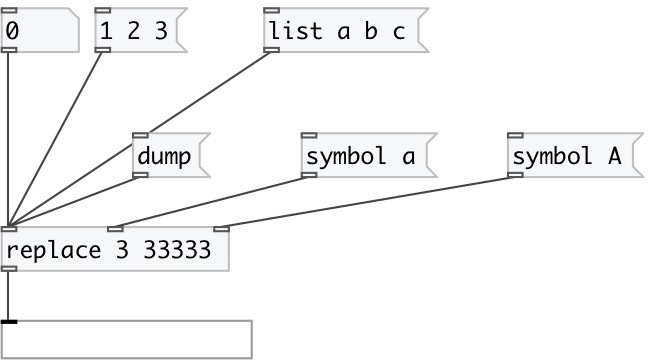

[index](index.html) :: [flow](category_flow.html)
---

# replace

###### Replace atoms in data stream

*доступно с версии:* 0.1

---

## информация
From/to values can be specified both as @from/@to properties or first and second arguments.

## аргументы:

* **FROM**
replace subject 
_тип:_ atom 

* **TO**
replace value 
_тип:_ atom 

## свойства:

* **@from** 
Запросить/установить replace subject 
_тип:_ atom 
_по умолчанию:_ None 

* **@to** 
Запросить/установить replace value 
_тип:_ atom 
_по умолчанию:_ None 

## входы:

* input data stream 
_тип:_ control
* @from property inlet 
_тип:_ control
* @to property inlet 
_тип:_ control

## выходы:

* output data stream 
_тип:_ control

## ключевые слова:

[replace](keywords/replace.html)
[test](keywords/test.html)

**Смотрите также:**
[\[flow.pass\]](flow.pass.html)

**Авторы:** Serge Poltavsky

**Лицензия:** GPL3 or later

