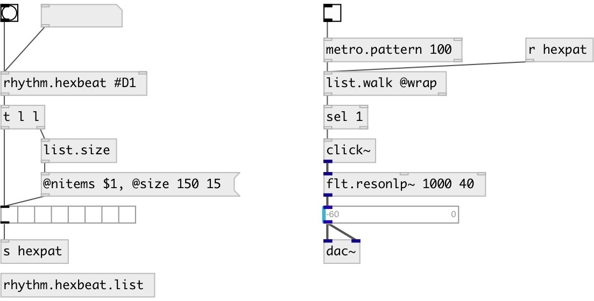

[index](index.html) :: [music](category_music.html)
---

# rhythm.hexbeat

###### hexbeat pattern generator

*доступно с версии:* 0.9.7

---

## аргументы:

* **HEX**
init pattern value 
_тип:_ symbol 

## свойства:

* **@pattern** (readonly)
Запросить list pattern 
_тип:_ list 

* **@hex** 
Запросить/установить hex pattern 
_тип:_ symbol 

## входы:

* output last pattern 
_тип:_ control
* set new pattern 
_тип:_ control

## выходы:

* list output 
_тип:_ control

## ключевые слова:

[conv](keywords/conv.html)
[rhythm](keywords/rhythm.html)
[hexbeat](keywords/hexbeat.html)

**Авторы:** Serge Poltavsky

**Лицензия:** GPL3 or later

