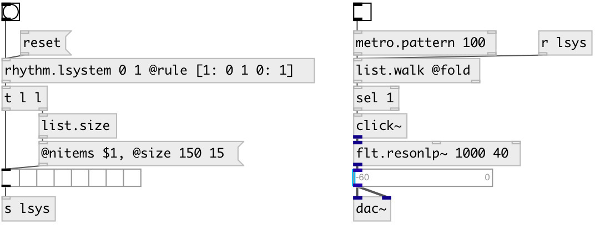

[index](index.html) :: [music](category_music.html)
---

# rhythm.lsystem

###### L-system pattern generator

*доступно с версии:* 0.9.7

---

## аргументы:

* **INIT**
init pattern 
_тип:_ list 

## методы:

* **reset**
reset to init state 

## свойства:

* **@init** 
Запросить/установить init pattern value 
_тип:_ list 

* **@value** (readonly)
Запросить current pattern value 
_тип:_ list 

* **@rule** 
Запросить/установить generation rule dict 
_тип:_ atom 

* **@max** 
Запросить/установить max generated pattern length 
_тип:_ int 
_диапазон:_ 1..32768 
_по умолчанию:_ 256 

## входы:

* output last pattern 
_тип:_ control

## выходы:

* list output 
_тип:_ control

## ключевые слова:

[conv](keywords/conv.html)
[rhythm](keywords/rhythm.html)
[lsystem](keywords/lsystem.html)

**Авторы:** Serge Poltavsky

**Лицензия:** GPL3 or later

