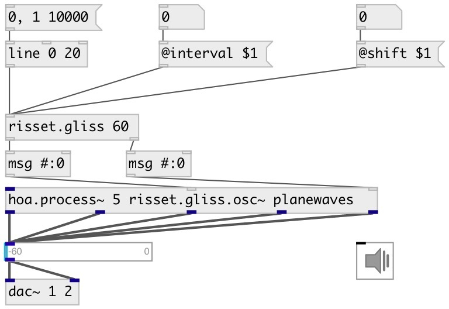

[index](index.html) :: [misc](category_misc.html)
---

# risset.gliss

###### Sheppard/Risset glissando calculator

*доступно с версии:* 0.9.5

---

## аргументы:

* **PITCH**
base pitch 
_тип:_ float 
_единица:_ semitone 

## свойства:

* **@base** 
Запросить/установить base pitch 
_тип:_ float 
_единица:_ semitone 
_диапазон:_ 10..100 
_по умолчанию:_ 60 

* **@n** (initonly)
Запросить/установить number of bands 
_тип:_ int 
_по умолчанию:_ 5 

* **@interval** 
Запросить/установить interval between bands 
_тип:_ float 
_единица:_ semitone 
_по умолчанию:_ 12 

* **@shift** 
Запросить/установить band shift in octaves 
_тип:_ float 
_по умолчанию:_ 0 

* **@ampexp** 
Запросить/установить amplitude exponent 
_тип:_ float 
_по умолчанию:_ 2 

## входы:

* glissando phase 
_тип:_ control

## выходы:

* list of midi pitches 
_тип:_ control
* list of amplitudes 
_тип:_ control

## ключевые слова:

[misc](keywords/misc.html)
[risset](keywords/risset.html)
[glissando](keywords/glissando.html)

**Авторы:** Serge Poltavsky

**Лицензия:** GPL3 or later

