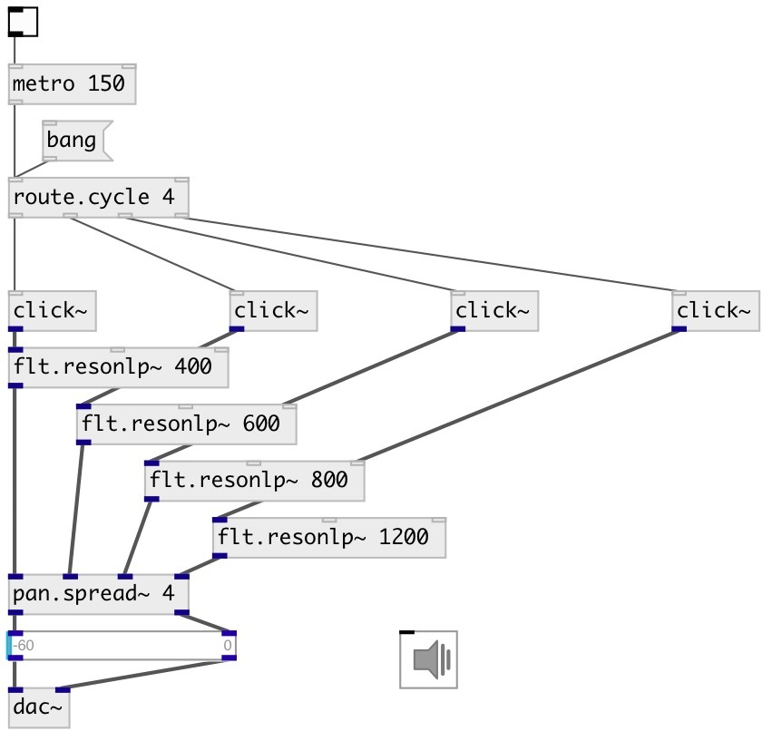

[index](index.html) :: [flow](category_flow.html)
---

# route.cycle

###### cyclic message router

*доступно с версии:* 0.9.7

---

## информация
NOTICE: to get properties use [prop.get] object, cause all messages (including property requests) are passed thru

## аргументы:

* **N**
number of outlets 
_тип:_ int 

* **OFFSET**
start position 
_тип:_ int 

* **STEP**
cycle step 
_тип:_ int 

## свойства:

* **@n** (initonly)
Запросить/установить number of outlets 
_тип:_ int 
_диапазон:_ 1..64 
_по умолчанию:_ 2 

* **@index** 
Запросить/установить current outlet index 
_тип:_ int 
_по умолчанию:_ 0 

* **@step** 
Запросить/установить cycle step 
_тип:_ int 
_по умолчанию:_ 1 

* **@offset** 
Запросить/установить init cycle offset 
_тип:_ int 
_диапазон:_ -64..64 
_по умолчанию:_ 0 

## входы:

* any to current outlet, then move to next 
_тип:_ control
* reset to initial outlet index 
_тип:_ control

## выходы:

* first output 
_тип:_ control
* ... output 
_тип:_ control
* nth output 
_тип:_ control

## ключевые слова:

[route](keywords/route.html)
[cycle](keywords/cycle.html)
[round](keywords/round.html)
[robin](keywords/robin.html)

**Смотрите также:**
[\[flow.ring\]](flow.ring.html)
[\[route.random\]](route.random.html)

**Авторы:** Serge Poltavsky

**Лицензия:** GPL3 or later

