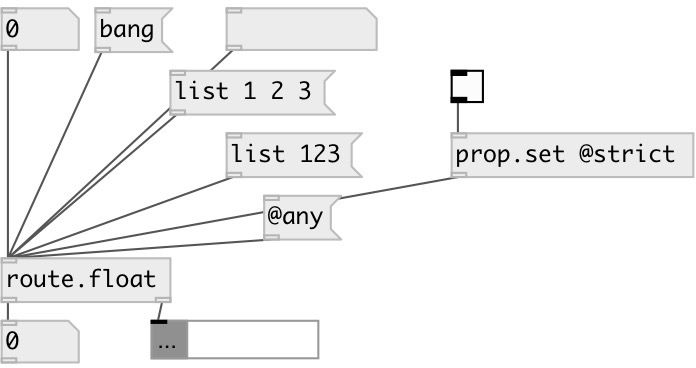

[index](index.html) :: [flow](category_flow.html)
---

# route.float

###### separate float messages from other types

*доступно с версии:* 0.9.2

---

## информация
to get properties use *prop.get* object, cause all messages (including property requests) are passed thru

## свойства:

* **@strict** 
Получить/установить strict mode. By default list with single float treated as float. Set to true to
disable this behavior 
_тип:_ int 
_варианты:_ 0, 1 
_по умолчанию:_ 0 

## входы:

* float to first outlet 
_тип:_ control

## выходы:

* float output 
_тип:_ control
* other messages 
_тип:_ control

## ключевые слова:

[route](keywords/route.html)

**Авторы:** Serge Poltavsky

**Лицензия:** GPL3 or later

