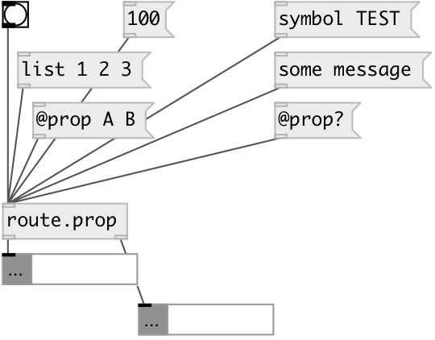

[index](index.html) :: [flow](category_flow.html)
---

# route.prop

###### separate property messages from other types

*доступно с версии:* 0.9.6

---

## входы:

* property to *first* outlet, any other messages to second outlet 
_тип:_ control

## выходы:

* property output 
_тип:_ control
* other messages 
_тип:_ control

## ключевые слова:

[route](keywords/route.html)

**Смотрите также:**
[\[route.float\]](route.float.html)
[\[route.any\]](route.any.html)

**Авторы:** Serge Poltavsky

**Лицензия:** GPL3 or later

