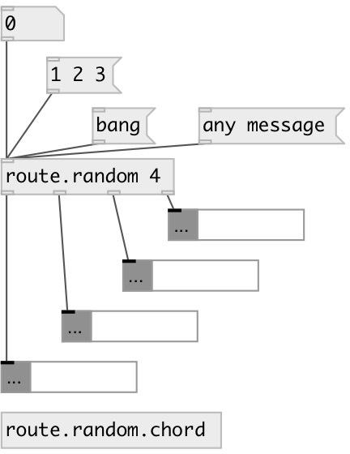

[index](index.html) :: [flow](category_flow.html)
---

# route.random

###### routes input flow to random outlet

*доступно с версии:* 0.9.6

---

## аргументы:

* **N**
number of outlets. See @n property 
_тип:_ int 

## свойства:

* **@n** (initonly)
Запросить/установить number of outlets 
_тип:_ int 
_диапазон:_ 2..64 
_по умолчанию:_ 2 

* **@seed** 
Запросить/установить generator seed 
_тип:_ int 
_минимальное значение:_ 0 
_по умолчанию:_ 0 

## входы:

* bang to random outlet 
_тип:_ control

## выходы:

* first outlet 
_тип:_ control
* ... outlet 
_тип:_ control
* n-th outlet 
_тип:_ control

## ключевые слова:

[route](keywords/route.html)

**Авторы:** Serge Poltavsky

**Лицензия:** GPL3 or later

