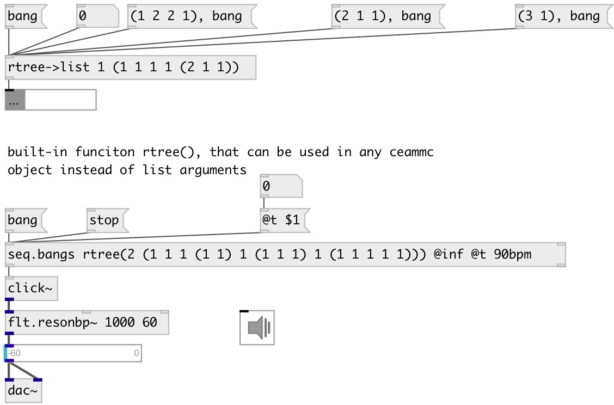

[index](index.html) :: [data](category_data.html)
---

# rtree.to_list

###### convert OpenMusic-like rythm tree to list of fractions

*доступно с версии:* 0.9.1

---

## информация
Rythm tree is structure to define complex rythmic patterns Examples: (1 1 1) - triplet, (2 1) - swing

## аргументы:

* **DUR**
total pattern duration 
_тип:_ float 

* **RTREE**
rythm tree 
_тип:_ atom 

## свойства:

* **@dur** 
Запросить/установить total pattern duration 
_тип:_ float 
_по умолчанию:_ 1 

* **@rtree** 
Запросить/установить rythm tree. (MList) 
_тип:_ atom 
_по умолчанию:_ () 

## входы:

* output 
_тип:_ control

## выходы:

* list output 
_тип:_ control

## ключевые слова:

[rythm](keywords/rythm.html)
[rtree](keywords/rtree.html)
[openmusic](keywords/openmusic.html)
[pattern](keywords/pattern.html)

**Авторы:** Serge Poltavsky

**Лицензия:** GPL3 or later

